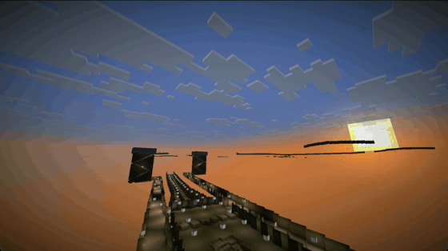
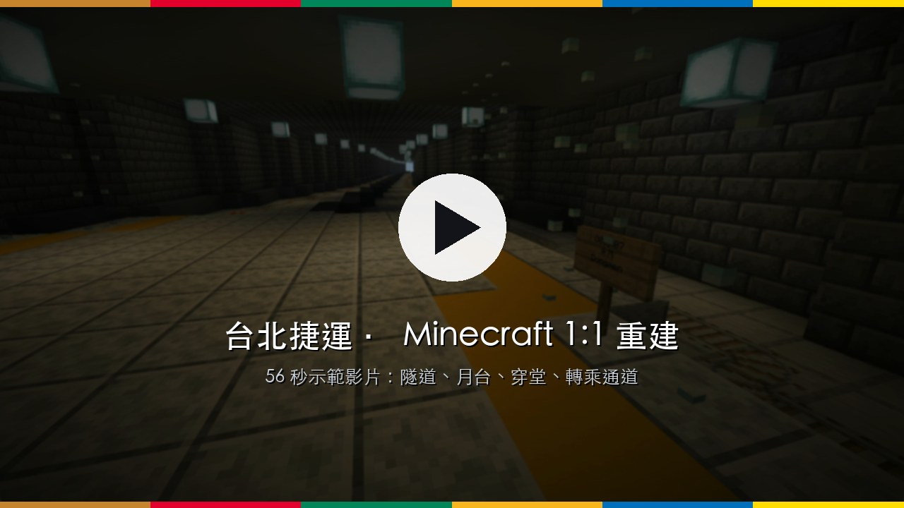
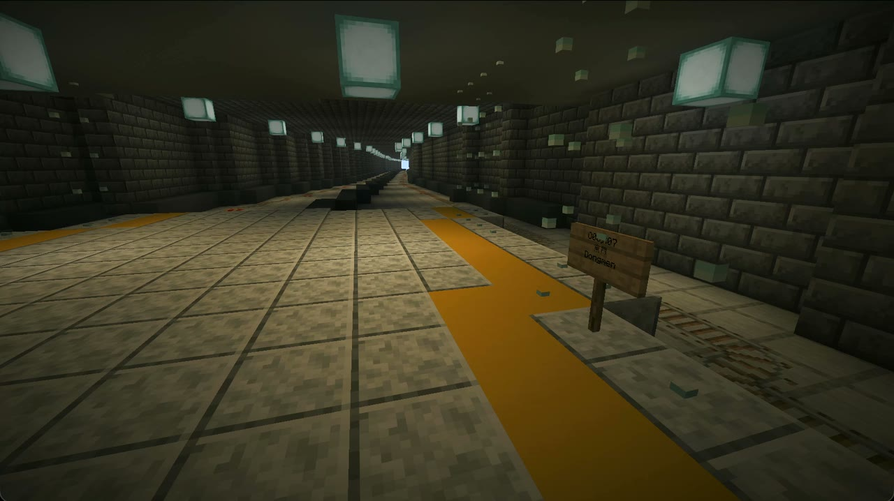
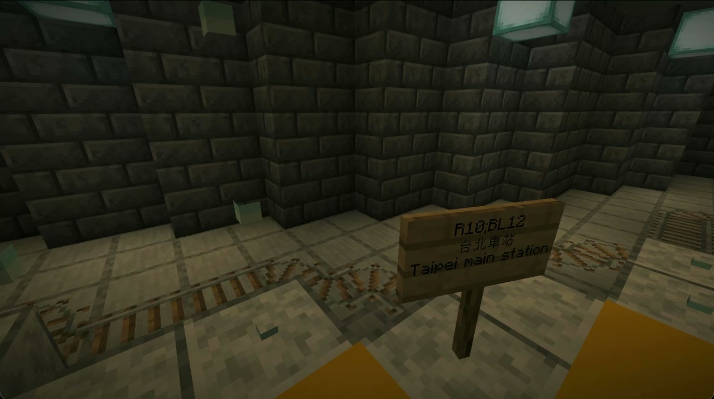
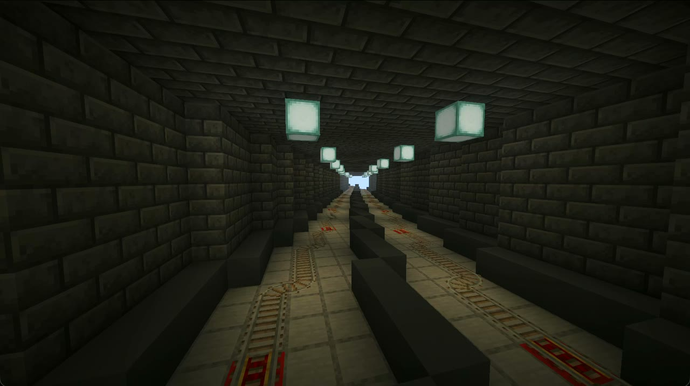
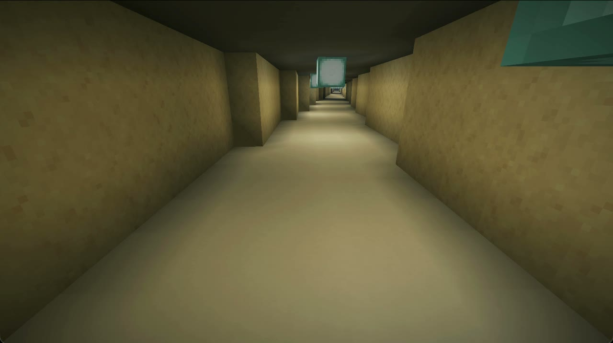
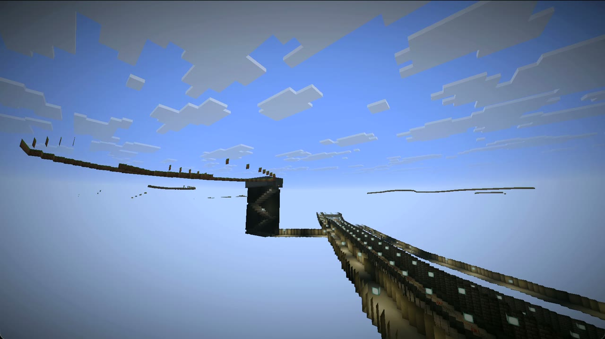
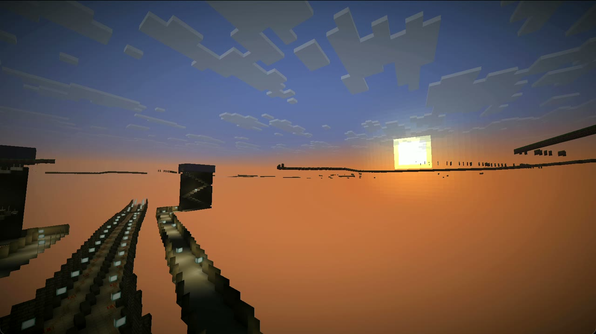
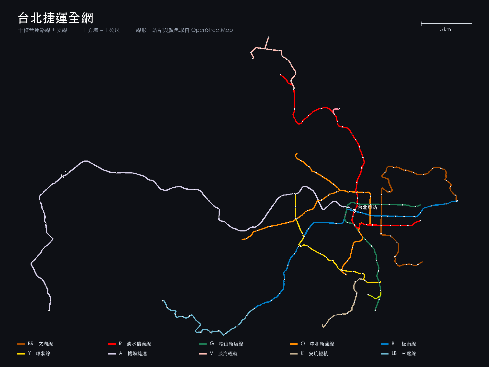

# 台北捷運 Minecraft 1:1 重建



把台北捷運全網（十條營運路線 + 支線，含三鶯線）以 **1 方塊 = 1 公尺** 的比例生成到
Minecraft Java Edition 26.2 存檔中，含真實地形、隧道／高架／平面三種結構、193 座車站
（地下站島式月台加穿堂層，高架與平面站側式月台加橋下或月台上方的穿堂，都有驗票閘門；
府中是側式疊式月台、西門是兩線共用的島式疊式跨月台轉乘站）、
475 座開在真實位置、掛著真實編號的出入口、19 座轉乘站的轉乘通道、
台北車站一帶 8.9 km 的地下街、站名告示牌、板南線的兩處袋狀軌，
以及全線可通行的雙線鐵軌。
從任何一座出入口的門口出發，不踩到一格土就能走到全網任何一座月台。

全部程式化生成 —— 482 km² 的範圍不可能手工堆。

> **不想自己跑生成？[直接下載已經蓋好的世界存檔](https://drive.google.com/file/d/19EMGXq1fSBxTu75KZ2nqXuztkm0jARfG/view?usp=sharing)**（Google 雲端硬碟，約 1 GB）
> —— 安裝步驟見下面「[下載已經蓋好的存檔](#下載已經蓋好的存檔)」。

## 示範影片

[](https://github.com/rareone0602/taipei-mrt-minecraft/blob/main/demo/tour.mp4)

56 秒，從地下隧道、島式月台、站名告示牌走到穿堂層與轉乘通道。
點圖片在 GitHub 上直接播（檔案是 `demo/tour.mp4`，1280x720、30 fps、無聲）。

## 世界裡長什麼樣

| | |
|:--:|:--:|
|  |  |
| **島式月台**　地下站的島式月台，月台邊鋪黃色警示帶 | **站名告示牌**　掛的是真實編號：`R10;BL12 台北車站` |
|  |  |
| **雙線隧道**　左右兩條軌道，全網鐵軌相通 | **人行通道**　穿堂層與轉乘通道；出入口到月台不必踩到土 |
|  |  |
| **車站剖面**　地下站體從穿堂到月台的樓梯 | **線形**　1 方塊 = 1 公尺，一路延伸到天際線 |

最後一列那兩張是在旁觀者模式鑽進地層裡拍的 —— 相機在實心方塊內部時
Minecraft 不畫地表，隧道與站體就這樣露出來，不是世界破洞。

## 全網



圖上的每一段線形、每一個站點都是真的拿去生成世界的那份資料
（`data/mc_lines.json`、`data/mc_stations.csv`），不是另外畫的示意圖。
比例尺 5 km 是世界裡的 5000 格。

## 下載已經蓋好的存檔

跑完整條管線要抓 OSM 與 DEM、再花二十幾分鐘生成。只想進去逛的話直接下載：

**[台北捷運 Minecraft 存檔（Google 雲端硬碟）](https://drive.google.com/file/d/19EMGXq1fSBxTu75KZ2nqXuztkm0jARfG/view?usp=sharing)** —— 約 1 GB，Minecraft Java Edition 26.2。

```bash
# 解壓縮後把整個 Taipei MRT 資料夾放進 saves/
mv "Taipei MRT" ~/Library/Application\ Support/minecraft/saves/     # macOS
# Windows: %APPDATA%\.minecraft\saves\   ／  Linux: ~/.minecraft/saves/
```

世界座標就是公尺，投影原點 `(0, 0)` 就是台北車站（OSM `ref=R10`）。進去之後
`/tp @s 0 67 0` 會站在台北車站正上方的地面 —— 讀回存檔確認過，那根柱子的地表是
y=66 的草地，往下 y=64 就是大廳的照明。

## 快速開始

```bash
python3 -m venv .venv && ./.venv/bin/pip install -r requirements.txt

./.venv/bin/python -m mrt.adapters.osm.fetch_network    # OSM 路線幾何
./.venv/bin/python -m mrt.adapters.osm.fetch_stations   # OSM 車站節點
./.venv/bin/python -m mrt.adapters.osm.fetch_way_tags   # way 標籤（判斷隧道/橋樑）
./.venv/bin/python -m mrt.adapters.osm.fetch_branch     # 補抓 ref 非標準代號的支線
./.venv/bin/python -m mrt.adapters.osm.fetch_details    # 出入口／站體建物／月台樓層
./.venv/bin/python -m mrt.adapters.osm.fetch_indoor     # 地下人行動線（地下街／穿堂）
./.venv/bin/python -m mrt.adapters.osm.fetch_sidings    # 袋狀軌／橫渡線／機廠線
./.venv/bin/python -m mrt.adapters.projection           # 投影到 Minecraft 座標
./.venv/bin/python -m mrt.adapters.dem.make_heightmap   # DEM -> 高程網格
./.venv/bin/python -m cli.build_world                   # 生成世界（--rails 才鋪鐵軌）

cp -R "out/Taipei MRT" ~/Library/Application\ Support/minecraft/saves/
```

相依套件與鎖定的版本在 `requirements.txt`，裡面註明了每個套件是哪個階段要用的。
venv 是 Python 3.9，程式沒有用 3.10+ 的語法。其中 `rasterio` 只有重跑 DEM 階段
才需要，`pillow` 只有 `tools/verify_render.py` 畫俯視圖時要 —— 兩個都可以不裝，
其餘步驟照跑。裝好之後所有指令一律用 `./.venv/bin/python`。

## 程式結構

相依方向一律由外往內，內層不得引用外層：

```
mrt/
  config.py         路徑與世界垂直範圍。所有層都可以引用
  domain/           純規則，零 I/O
    alignment.py      取樣、縱斷面、軌道離線位、路線變體挑選
    geometry.py       多邊形填充、外牆描邊、四坡屋頂
    rails.py          中心線 -> 鐵軌方塊與 shape
    terrain.py        高程網格取樣
    tunnel_layers.py  地下線的深度帶指派
    concourse.py      地下街：level 標籤解析、通道併點與連通、出入口接駁
    exits.py          真實出入口與轉乘通道：井與通道的擺放、與所有結構的避讓
    walk.py           行走可達性：給一個「這格能不能站」就洪水填滿
  ports/            內層對外層開的介面
    block_sink.py     BlockSink（逐格）、ChunkSink（整段批次）、DictSink（測試用）
  application/      用例：把 domain 算出來的東西寫進 BlockSink
    build_line.py     地下／高架／平面三種斷面與車站
    build_world.py    地形 chunk 組裝、走廊漸變
    landmarks.py      台北車站（照實際圖面蓋，不是樣板）
    build_concourse.py 地下街：通道地板、店面、出入口樓梯、層間樓梯井
    build_exits.py    真實出入口與轉乘通道：把 exits.py 的計畫變成樓梯井、接駁通道與空橋
    build_br.py       文湖線專用（第一條線的垂直切片，留著當對照）
  adapters/         外部資料進來
    osm/              Overpass 查詢與解析
    dem/              DEM 重新取樣
    projection.py     WGS84 -> TWD97/TM2 -> MC 方塊座標
  infrastructure/   外部技術細節
    mcworld.py        Anvil 區域檔寫入（實作 BlockSink / ChunkSink）
    savereader.py     Anvil 讀回：把一塊立體範圍讀成可查詢的方塊陣列，讀告示牌
    overpass.py       Overpass HTTP：鏡像輪替、重試、快取

cli/                組合根。唯一看得到全部實作的地方
tools/              驗證與檢視：獨立讀回存檔，不信生成器的自述
tests/              不需要產生世界就能跑的測試
```

生成器一直都是把世界當參數收（`def build_station(w, ...)`）而且只呼叫
`w.set()` —— 介面本來就存在，`ports/block_sink.py` 只是把它講出來。
所以測試可以塞一個 dict 進去，不必先產生 1 GB 的存檔。

分層靠 `tests/test_architecture.py` 守住：它 parse 每個模組的 import，
內層引用外層就讓測試紅掉。目錄名稱本身擋不住任何人。

## 核心決定

| 項目 | 選擇 | 理由 |
|---|---|---|
| 比例 | 1 方塊 = 1 公尺 | 6 節列車 ≈ 138 m，月台、閘門、樓梯尺寸才對得上 |
| 投影 | TWD97 / TM2 (EPSG:3826) | 與國土測繪中心 DTM 開放資料同一坐標系，地形可直接套入 |
| 原點 | 台北車站 = MC (0, 0) | TWD97 E=302214.8 N=2770999.4 |
| 軸向 | MC X = 東，Z = 南 | 北方為 −Z |
| 海平面 | y = 62 | 台北盆地地面約 y=67~92，最深車站約 y=42 |

驗證：台北 101 (25.0330, 121.5654) → TWD97 E=307,056.8 N=2,769,551.8，與公開值相符。

## 管線各階段

**1. OSM 路線幾何** — Overpass API，三個鏡像輪替、九次重試。
relation 的成員順序不保證、方向可能相反，直接串接會產生橫跨地圖的假直線
（未接合前全網「長度」是 401 km，接合後 210 km）。`stitch()` 以端點相接，
接不上就另開一段，寧可留缺口也不用直線硬連。

**鏡像的資料日期要看。** 三鶯線一直抓不到，不是因為還在興建：它的 relation
早在 2015 年就有 `ref=LB`，但 `route=subway` 這個標籤到 2026-06-30 才補上，
在那之前用 route 篩的查詢一條都回不來。原本抓到的空檔案來自一個資料凍結在
2026-05-31 的鏡像，而 `fetch_network` 看到檔案存在就略過，空檔案永遠不會重抓
（現在會：`elements` 是空的就當沒抓過）。`fetch_way_tags` 的路線清單也要
有 LB，否則整條線會被當成平面 —— 它其實 100% 高架。

各線長度可對照官方數據驗證：文湖線 25.7 km（官方 25.7）、淡水信義線 29.6（29.5）、
環狀線 15.3（15.4）、機場捷運 51.9（51.0）。

**2. 隧道／高架判定** — relation 的 `out geom` 不含成員 way 的標籤，
但成員有 way id；另查一次標籤再 join。結果與現實相符：
板南、松山新店、中和新蘆 100% 地下，環狀線 97% 高架，淡水信義線三種都有。

**3. 支線** — 同一條線在 OSM 常有多個 relation：上下行、支線、直達車／普通車。
全部照蓋會讓上下行變成兩座並排的結構，只蓋最長的又會漏掉支線。
`select_variants()` 分兩步：先用端點配對收斂上下行（端點相同或互換，
且長度差 20% 以內），再對倖存者算未覆蓋的絕對長度。32 個變體收斂成 13 個。

對應結果：`mc_stations.csv` 的 185 座車站中，172 座落在選用變體 150 m 內。
沒對上的 13 座分成兩類 —— 11 座是三鶯線（路線關聯還沒抓進來，見「已知限制」），
另外 2 座是機場第一／第二航廈，站點節點標在航廈建物上而非月台，離線位 176 / 311 m。

**4. 縱斷面** — 目標高度 = 地面 + 偏移（高架 +13 m、平面 +1 m、隧道 −20 m），
再用 4% 最大坡度取下包絡線平滑。隧道口前會自然出現引道。
**結構型態依實際高程決定，不是依 OSM 標籤** —— 引道段仍掛著 `bridge` 標籤
卻已降到地面以下，照標籤蓋會把橋面埋進土裡。

**5. 地形** — DEM 重新取樣成以台北車站為原點的 20 m 網格。
主要來源是國土測繪中心 20 m **DTM**，原生就是 TWD97 / TM2，
與本專案座標系同源，所以只是平移取樣，完全不必重投影。
只在路線走廊內生成（預設 ±96 m 完整、再 64 m 漸變回平坦海平面），
否則 43 × 30 km 全鋪需要數百萬個區塊。

**6. 世界寫入** — `mcworld.py` 直接寫 Anvil 區域檔，不依賴任何 Minecraft 函式庫。
26.2 的存檔佈局是 `dimensions/minecraft/overworld/region/`，
世界生成設定搬到 `data/minecraft/world_gen_settings.dat`。
按 region 串流：整片地形放不進記憶體，逐 region 建完就寫出釋放。

## 兩個容易踩的坑

**寫過的區塊必須自己填背景地層。** 我們標了 `Status: minecraft:full`，
遊戲就不會再生成地形。不填的話隧道會是懸在虛空裡的管子。

**告示牌文字在 1.21.5 起改成原生 NBT，不再是 JSON 字串。**
`messages` 是四個純字串的 List，且 NBT 清單必須同型別 —— 混入 compound 會壞掉。
因為我們直接寫 DataVersion 4903，不會有 DataFixerUpper 幫忙轉換舊格式。

## 驗證

不相信生成器的自述，一律從磁碟獨立讀回來比對。不必產生世界就能跑的部分：

```bash
./.venv/bin/python tests/run_all.py
```


- `roundtrip.py` — 4,235 個方塊跨 chunk/section 邊界、負座標、y=−64~319、含方塊狀態
- `tools/verify_render.py` — 讀回區域檔算俯視圖，未列入配色的方塊會顯示洋紅。
  `--bbox X0 Z0 X1 Z1` 可以只畫一小塊出局部特寫（配 `--scale 1` 就是 1 m/px）。
  **注意**：終端輸出只列前 20 種方塊，新加的材質排不進去就看不到「未列入配色」
  的提示 —— 要直接掃圖上有沒有洋紅像素才算數（而且洋紅會被高度陰影調暗，
  判斷條件是 g=0 且 r=b，不是 r>200）
- `tools/verify_concourse.py` — 讀回地下街，檢查每個出入口**不出地面**就走得到彼此。
  這一條「不准走到地面」是整支工具的重點：出入口本來就都開在同一條街上，
  容許走地面的話一定全部相連，等於什麼都沒驗到。「地下」逐格看當地地表
  （腳比地表方塊低兩格以上），不是一個全域的 y 上限。判斷用的是玩家真的走得動的
  規則（`mrt/domain/walk.py`：四鄰域、上下各一格、頭頂兩格淨空、站在下半磚上
  要三格、認得下半磚），
  移動規則刻意做成對稱的 —— 真實 Minecraft 可以往下摔任意高度，用那個來驗
  會把「跳得下去、爬不上來」的斷頭樓梯判成通過
- `tools/verify_exits.py` — 讀回告示牌找出每座出入口亭，從門口出發**不踩土**
  （腳下只准是人造方塊）走到月台的黃色警戒帶。這條規則比「不出地面」更嚴：
  出入口亭本身就在街上，容許踩地形的話，任何一座樓梯壞了都能沿街走到隔壁
  出入口再下去，等於什麼都沒驗到。轉乘站的出入口還得全在同一個連通分量裡，
  分成兩團就是轉乘通道沒接上
- `tools/verify_rails.py` — 讀回全部鐵軌，檢查每根宣告的連接方向對面真的有軌道接回來、
  斜軌高程對得上、底下不是空氣。生成器自己的單元測試只證明「算出來的路徑」合法，
  證明不了寫進世界之後還是那樣
- `tools/verify_tracks.py` — 讀回某一點沿線每公尺一刀的鐵軌：幾股、各在哪個離線位與
  高度。疊式站（`--station 西門 --expect 4 --levels 2`）與袋狀軌（`--xz --dir`，
  中間那一刀要有三股）就是靠它從磁碟上數出來的；`verify_exits --levels 府中 西門`
  另外要求這兩站的出入口走得到上下兩層月台的警示帶
- `tests/` — 幾何、線形、鐵軌、地標各自帶單元測試（多邊形填充面積、外圈、內縮、
  屋頂收斂、折返梯的踏面與淨空），不必產生世界就能跑
- `mrt/domain/tunnel_layers.py` — 分帶後自己驗算：任兩條異線的地下格若相鄰，帶號必須不同
- ASCII 橫斷面 — 直接把剖面印出來看

這樣抓到過：懸空隧道、被覆蓋掉的樓梯半磚（`STEP=0.5` 導致每階只前進 1 m）、
相機 `clip_end` 預設 100 m 造成的全黑算圖。

後來用「舊版程式蓋同一塊地、逐格 diff」又抓到一批，每一件在生成紀錄裡都是
「已完成」：

- **共用幹線把十二座車站挖空。** 中和新蘆線兩個變體共用 13 km 幹線，
  以為蓋兩次只是浪費時間。其實第二份是在第一份的車站蓋好之後才掃過去的，
  而它的重複車站已經被去重砍掉、沒有張開段，一條 15 m 寬的素隧道直直穿過
  25 m 寬的站體 —— 頂溪到大橋頭 12 座車站的月台、月台門、穿堂樓板全部
  變成空氣，七張、北投與淡海輕軌七站被抹掉一部分。現在共用路廊的斷面
  只蓋一次
- **河面上浮著一層草皮。** 整個 section 都是空氣就不寫，存檔時沒寫過的
  section 會填回超平坦背景（草皮在 y=64），基隆河、淡水河面上因此浮著
  一層 y=64 的草，底下是空氣、再底下才是水。圓山到劍潭的河段 12.7% 的
  地表格都是這樣
- **樓梯頂端差一格。** 地表方塊 y=g、人站在上面腳在 g+1，三種樓梯都爬到 g
  就停，出門要跳一格、進門掉一格。行走驗證上下各容許一格，看不出來
- **`runs()` 每個空隙後面漏看一格**，剛好 200 m 的支線整段消失
- **`verify_rails` 每 16 排漏驗一排**：鐵軌落在 section 最底一排時，
  底下那格在下一個 section 裡，原本只在同一個 section 內往下看
- **`slice_world` 切錯站**：站名用包含比對，「中山」先撞到「中山國中」
- **驗證器自己也會騙人。** 把「地下」定成一個全域的 y 上限，車站多加兩座、
  地面低 3 m，整條地下街就被判成地表；用出口編號當鍵，西門捷運站 1 號與
  西門地下街 1 號互相蓋掉；讀回的高度只到出口牌上方 6 m，高架站的月台
  在 14 m 上面，整批高架站被判成走不到月台。現在「地下」逐格看當地地表，
  鍵帶座標，往上讀 32 m
- **十座終點站只有半座。** 線形在終點站的站點就結束了，站體後半段沒有
  取樣點可蓋，淡水站的穿堂到站體中心就是一面牆。現在端點沿切線延伸尾軌
- **斜 45 度的兩格寬樓梯走到一半斷掉。** 相鄰兩階的格子只有斜角相接，
  剖面上每一階都在。現在每一階補鋪中間那個半公尺取樣點的格子
- **同層轉乘通道把對面的洞封死。** 紅樹林 R/V 的通道一頭在淡水線站體、
  另一頭穿進輕軌站體，地板外緣一圈砌牆時把輕軌穿堂裡洞口內側也砌上了
- **轉乘通道斜切過自己的井。** 板橋、頭前庄、南港展覽館的轉乘井四個方向
  都能擺，站體在井的側後方時，從門廊轉向站體的直線穿過井身；井是在通道
  之後蓋的，井壁一補回去通道就斷了，規劃時的碰撞檢查又把井身豁免掉。
  現在通道格落在井身裡就換下一個候選位置
- **支線起點被當成終點延伸。** 小碧潭支線從七張出發，「端點附近有車站就
  延伸尾軌」把它往七張的方向多伸了 35 m，直直插進幹線的七張站體。
  同一條線另一個變體經過的端點不是終點，不延伸
- **山坡上的出入口門口踩不到街。** 木柵、淡江大學、鶯歌車站的井蓋在坡上，
  門檻兩側的地形高低差兩三格。現在街上那扇門前鋪一小塊前庭（草皮地坪、
  兩格淨空）
- **街面與穿堂只差 2 m 的井，門洞只剩一格。** 井的兩扇門開在同一面牆上，
  井底那扇的上限夾在井口平台之下，站立面落差 2 格時門洞只剩一格高，門前的
  前庭又剛好把空橋的樓板清掉 —— 淡江大學的出入口就是這樣「門口沒有接到街面」，
  全網 474 座裡唯一沒過的一座。原本 `MIN_RISE` 是 2；現在差不到 3 m 不蓋井，
  改成平面出入口（見「高架站與平面站」）

`tools/slice_world.py` 直接從存檔切 ASCII 剖面，是唯一能看出「蓋出來的東西
到底長怎樣」的方法：

```
./.venv/bin/python tools/slice_world.py 忠孝復興          # 垂直於路線
./.venv/bin/python tools/slice_world.py 忠孝復興 --long   # 沿著路線
```

車站兩端被襯砌牆封死、出入口只有一口沒有階梯的直井，都是這樣看出來的。
`--save <存檔>` 可以改讀測試用的存檔。

`verify_rails.py` 抓到過的：軌道懸空（`rails.py` 為了讓斜軌落在直線段上會把高差
前後挪幾格，挪過的那幾格就浮在走行面上方一格）、安坑輕軌終點一處 180 度折返
把兩股道推到同一批格子上、以及支線與幹線共用路廊時互相蓋掉對方的軌道。

## 資料來源

- **路網／車站**：OpenStreetMap（ODbL）
- **台北車站圖面**：臺鐵「出借範圍示意圖（核定版 1140101 起實施）」，
  用圖上的 8.75 m 柱網獨立驗證 149×110 m 與 8 根大廳柱
- **地形（主要）**：內政部國土測繪中心 20 m **DTM**（2025 版分幅，臺北市 + 新北市共 403 幅）
  - 放在 `data/dem/nlsc20/*.zip`，**不必解壓縮**，`make_heightmap.py` 直接讀 zip
  - 格式是每幅一個 ASCII 的 `E N Z`，原生 TWD97 / TM2 + TWVD2001，落在整齊的 20 m 格網上
  - `tgos.tw` 擋 curl，這兩包是請人用瀏覽器下載後轉交的
- **地形（補洞）**：Copernicus DEM GLO-30（© DLR e.V. 2010-2014、© Airbus Defence and Space GmbH 2014-2018，
  under COPERNICUS by the European Union and ESA）
  - DTM 只涵蓋雙北，機場捷運西段進入桃園後沒有資料，該區退回用 GLO-30
  - GLO-30 是 **DSM**，建物與樹冠烤在高程裡，系統性偏高（沿路網中位數 +4.8 m），
    所以補洞前先扣掉這個偏差，交界再做 400 m 羽化混合，免得出現斷崖

## 車站構造

地下站是**島式月台 + 上方穿堂層**的雙層箱涵，斷面 25 m 寬、13 格高：

```
dy 10  ────────────  頂板
dy 7~9              穿堂層（驗票閘門在這一層）
dy  6  ────────────  穿堂樓板（月台上方開口下樓）
dy 2~5              月台淨空 / 月台門
dy  1   ▓▓▓▓▓▓▓     島式月台（13 m 寬，兩側警示帶）
dy  0   ══     ══    軌道走行面，鐵軌在 dy 1，離線位 ±8
dy -2  ────────────  底板
```

北捷地下站幾乎都是島式。側式月台的話中間的軌道會把穿堂動線切成兩半，
每側月台都得再來一組樓梯與閘門。

區間隧道只有 11 m 寬、軌道離線位 ±3，所以進站前 40 m 要把軌道張開到 ±8、
隧道半寬同步從 5 撐到 10（`track_offsets()`）。直接跳過去的話鐵軌會斷成兩截。

**高架站與平面站是側式月台**，穿堂層放哪裡看軌面高出地面多少
（`alignment.station_kind`，全專案只有這一個定義）：

- **橋下**（軌面高出地面 9 m 以上，81 座高架站）：穿堂在月台正下方，
  站立面 = 軌面 − 6，橋面板就是頂板，玻璃側牆，高架橋的橋墩穿過大廳當柱子。
  文湖線、淡水線的高架站現實中就是這樣
- **月台上方**（平面站與矮高架，19 座）：穿堂是跨在兩座側式月台上方的天橋，
  站立面 = 軌面 + 8，樓板疊在站屋屋頂上。淡水線平面站的天橋式穿堂

閘門橫在穿堂 `lo + 14 m`，兩座月台各一座兩格寬的樓梯下到（或上到）穿堂，
都放在站體的 `hi` 端 —— 放在 `lo` 端的話會挖到出入口通道開洞的位置旁邊，
橋下那種的梯腳還會落在閘門線上。這樣月台的走道不會被洞切斷，
兩座月台第一次可以互相走到（原本第二座月台根本沒有樓梯）。

原本那座「沿站體外側爬 2:1 直梯到地面站屋」的樣板樓梯，現在只在真實出入口
與預設出入口都擺不下的時候才蓋（見下一節）。

## 疊式車站與袋狀軌

朋友看了板南線之後指出四件事：府中不是島式月台、西門應該是平行轉乘的站體、
忠孝復興—忠孝敦化之間沒有袋狀軌、亞東醫院—海山之間也該有。四件都對，
而且前兩件是同一個結構問題：**一條線的兩股道在車站分到上下兩層**
（`mrt/domain/stacked.py`）。

- **府中**（地下五層，側式疊式月台）：B3 一月台往南港展覽館、B5 二月台往頂埔，
  兩股道上下疊在同一個位置，月台都在往南港展覽館方向的左側。OSM 的兩塊
  月台多邊形（level −3 / −4）落在完全相同的位置，就是這個意思。
- **西門**（島式疊式月台、跨月台轉乘）：B2 是板南線往南港展覽館＋松山新店線
  往松山共用一座島式月台，B3 是往頂埔＋往新店共用另一座。板南線的兩股道疊在
  西側、松山新店線的疊在東側，OSM 兩條線的中心線在站區相距 17～18 m，
  兩塊月台（layer −2 / −3）的中心正好在中線上。

做法：站體外 240 m 起，其中一股道以 4% 下潛 8 m（北捷靠右行駛，往上層那個
方向開的列車走行進方向右側那股，對面那股下潛），進站前 40 m 兩股道從 ±3 併到
同一個離線位。站體是 21 格高的雙層箱涵 —— **上層就是原本的島式站（穿堂仍在
軌面 +7），下層整層複製到 8 格底下**，所以出入口、轉乘通道與所有驗證工具
一行都不必改；上層月台再開一座 16 m 的樓梯下到下層。西門由板南線蓋一座
以兩線中線為準的站體，每層「一股板南、一座島、一股松山新店」，松山新店線
在站體範圍內不蓋斷面、不再有自己的車站，出入口全部掛在這座共用的站體上；
兩線的軌面釘成一樣（`stacked.pin_profile`），釘平段兩側再以 4% 收斂回原本的
縱斷面。

分層過渡段的斷面不能再用「一個箱涵、兩股道」畫：下潛那股道的箱涵一路從隔壁
滑到正下方。`build_line.sec_multi` 逐點把每股道的箱涵取聯集，襯砌只砌在
聯集的外圈，上層先鋪、下層的淨空不會把上層的樓板挖掉。

**深度帶差點被自己的釘樁搞壞。** 西門的兩條線都釘在最淺的帶，松山新店線的
釘樁在 assign_bands 裡是「帶 0 在西門一帶被 G 占了」，板南線往前探到就在
台北車站與西門之間潛到帶 2，再被自己的釘樁拉回帶 0 —— 縱斷面因此把西門與
台北車站都拖低 13 m，台北車站的板南線直接撞進淡水信義線的站體。現在共用
站體的兩條線在站區 500 m 內彼此不算占用（`assign_bands(shared=…)`），而且
規劃完會拿每一點真正的箱涵範圍（半寬、上下緣）再算一次跨線淨距
（`tunnel_layers.check_clearance`）——帶號的驗算只知道帶號不同，
21 格高的雙層箱涵比一帶還高、釘平的縱斷面又會離開帶的深度。

**袋狀軌**照 OSM 畫的位置鋪（`data/sidings.json`，`fetch_sidings` 抓的；
板南線的兩處 OSM 都有畫，亞東醫院那五條 way 就叫「亞東醫院袋狀軌」）：
正線先張開到 ±6、中間鋪第三股道（忠孝復興—忠孝敦化 212 m、亞東醫院—海山
197 m）、再收回 ±3。沒有道岔（見已知限制），第三股道在正線收攏到離它
不到 4.5 m 之前就結束。捷運公司的駕駛室影片在亞東醫院開車後 29～68 秒
看得到這座箱涵、兩端的道岔與第三股道，位置與 OSM 一致；車迷畫的兩份
軌道配置圖與維基百科都只列這兩處。

**從存檔讀回來驗**（四塊 `--bbox` 各蓋一次，再蓋全網）：`tools/verify_tracks.py`
在西門站體中心那一刀數到四股鐵軌、分布在兩個高度（軌面 y51 與 y43），
板南線的兩股疊在西側、松山新店線的疊在東側 16 m 外；府中兩股疊在同一個
離線位、月台在同一側；兩處袋狀軌中間那一刀都是三股（−6 / 0 / +6）。
`verify_exits --levels 府中 西門`：府中 2 座、西門 14 座出入口全部走得到
上下兩層月台的警示帶，西門的 14 座在同一個連通分量裡（跨月台轉乘不必另接
轉乘通道）；`verify_rails` 只剩正常端點。西門原本 15 座出入口分掛在兩條線
各自的站體上，現在全掛在同一座，5 號擠不進去 —— 全網 476 座變 475 座。

## 真實出入口

除了台北車站以外，每座車站原本只有一座樣板樓梯，開在站體側邊固定的位置。
但 `data/entrances.json` 早就有全網 786 個真實出入口的座標與編號 ——
公館有 27 個、中正紀念堂 6 號出口離站體 264 m。現在全網 193 座車站全部照著資料蓋：
186 座站體共 **475 座出入口**（470 座折返式樓梯井、5 座平面出入口；含複合體裡
地下街接不上、退回這裡各自接進所屬站體的 7 座），每一座門口都立著
「出口 N／站名／Exit N」；資料裡沒有出入口的 33 座站體（機場捷運桃園段、安坑輕軌、
淡海輕軌的平面站）用一個預設位置的出入口走同一套流程。

每個出入口三件事（`mrt/domain/exits.py` 算位置，`application/build_exits.py` 放方塊）：

1. 一座折返式樓梯井（就是台北車站連絡梯用的那個 `ShaftStair`，把 `g0`
   換成真實地面）從街上下到穿堂層的高度
2. 一段接駁通道，從井底的門沿站體外側走到站體側牆
3. 側牆開一個洞，通進穿堂層閘門前的非付費區

資料裡踩到的三件事決定了做法：

- **出入口不在站體旁邊。** 沿線距離的中位數 73 m、九成在 240 m 內 ——
  一半以上的出入口落在 70 m 的月台範圍之外。所以通道不能垂直穿進去，
  得先沿站體外側走到開洞的位置（`lo + 7 m`，閘門在 `lo + 14`）。
  通道一律走在離線位 15（站體半寬 12 再往外 3），沿著取樣點跟線形走，
  站體再彎也不會切進去
- **出入口常常就在隧道正上方。** 一成的出入口離中心線不到 10 m。井從地面
  一路挖到穿堂層，直接放會把區間隧道的頂板挖穿。所以井沿法向往外推，推到
  井身每一格（含一格邊距）離中心線至少 18、與所有路線的地下結構都不相撞
  為止。**要逐格量，不能只量門**：井只能擺成正交的四個方向，線形斜 45 度時
  井的角會比門近 4 m（府中站的 1 號出口通道就是這樣被自己站的井擋掉的）。
  半數的井一格都沒推，九成推不到 17 m
- **轉乘站的出入口是共用的。** 忠孝新生的 14 個出入口同時掛在板南線與
  中和新蘆線名下，每個只接離它最近的那座站體。同編號畫了兩個節點的
  （OSM 常每條線各標一次，府中 1 號兩個節點差 26 m）併成一座，
  否則兩座井一前一後疊在同一條法線上，後面那座的通道被前面那座擋死

**避讓靠一張有高度的占用表。** 所有路線的隧道、站體、橋墩、地面站廳先刷成
「這一格在 y0..y1 之間有東西」；井與通道規劃時逐格查，通道另外查自己這一站
已經蓋好的井、別站的通道，以及地形 —— 通道是平的、地形不是，板橋站往環狀線
那頭地面低了 6 m，通道走過去頂板會冒出街面。轉乘站兩座站體的穿堂層差 15 m，
兩邊的通道在平面上交叉但根本碰不到，所以占用表一定要帶高度，否則轉乘站
一半的出入口都會被自己人擋掉。通道檢查時略過**自己那一段路線**：通道本來
就沿自己的線走，只有斜線光柵化的邊界會與襯砌最外一格擦到同一格，那不是相撞
（這一條略過之前，三分之二的出入口被判成「撞到別線」）。

接不上的 21 個各有理由，報表會印：撞到別的井或通道 13（其中 4 個是複合體
退回來的，1 個是西門 5 號 —— 西門的 15 座出入口原本分掛在兩條線各自的站體上，
現在全掛在同一座共用站體，最後那一座擠不進去）、通道會露出地面 4、撞到別線的結構 2（北投的兩個，正下方是
新北投支線）、離站體 350 m 以上 1（忠孝新生的新生南路緊急出口）、井擺不下 1
（東湖 2 號：1 號改成平面出入口以後通道剛好從 2 號門前經過，井往外推又撞到
1 號的坡道）。

### 高架站與平面站

同一座井、同一套幾何，只是哪一扇門在上面不一樣：地下站的井從街上往下挖到
穿堂，高架站的井從街上**往上爬**到橋下的穿堂（出口牌改立在下面那扇門邊），
接駁通道變成玻璃欄板的空橋，地形比它低就每 6 m 架一根柱子。占用表把高架站
連橋下／月台上方的穿堂一起記進去，通道不再有「不准露出地面」的規則 ——
空橋本來就在地面上，地形高過它就切進坡裡。

**街面與穿堂差不到 3 m 的不蓋井，蓋平面出入口**（`exits.place_gate` /
`build_exits.GroundGate`；木柵、東湖、淡江大學、淡金鄧公、鶯歌車站各 1 座）。
橋下穿堂只比地面高 3～7 m，山坡上的出入口街面可能就在穿堂那個高度前後兩公尺內。
這時井蓋不出來 —— 井的兩扇門開在同一面牆上，落差不到三格井底的門洞只剩一格 ——
也根本不需要井：通道的盡頭就是門，門外每格升降一格接到街面，再鋪三格長的前庭，
出口牌立在前庭旁邊。通道的刷寬會蓋過門外兩格，坡道在地板之後蓋，把那兩格改成階梯。

### 轉乘通道

19 座轉乘站（台北車站複合體以外；西門兩線共用一座站體，同一座島式月台
就是轉乘，見「疊式車站與袋狀軌」）的兩座站體之間接一條**付費區對付費區**的
轉乘通道（`exits.plan_transfer`）。兩層一樣高（新北產業園區 A/Y、紅樹林 R/V
只差 1 m）就一條通道直接接；不一樣高就在兩座站體之間立一座折返梯井，
兩層各接一段通道到井的門，井的兩扇門邊各立一面「轉乘／往 X 線」的牌子。
忠孝復興、大安、南京復興、南港展覽館這種地下對高架的，井從橋下穿堂一路
下到地下穿堂，塔身穿過街面 —— 忠孝復興現實中的轉乘也就是那樣一座塔。

井擺哪裡：以兩座站體付費區側牆帶最近的接點對為中心撒一張 4 m 網格，離兩邊
都近的先試。十字交叉的轉乘站（古亭、東門、西門、中正紀念堂……）兩座站體的
接點就在交叉點旁邊，網格中心附近全都離兩條線太近，井得退到交叉的某個象限
裡 —— 先用井心粗篩、過了才逐格細查，否則前六百個候選全在交叉點上打轉。
洞開在閘門之後 4 m 起、離端牆 4 m 止，高架穿堂再避開 `hi` 端的月台樓梯；
而且只挑軌面高度跟出入口開洞處一樣的位置，站內軌面有坡的話兩片地板才併得成一片。

**先接轉乘還是先接出入口**，兩座站體之間就那麼一點空間：南港展覽館十座
出入口先擺進去，轉乘井就沒地方放；反過來先擺轉乘井，大坪林會少接兩座出入口。
所以每座轉乘站兩種順序都規劃一次（占用表複製一份試），留分數高的
（一條轉乘通道抵四座出入口：少接一座出入口只是繞遠，兩座站體不通是斷的）。
結果 19 條全接上，出入口只比不接轉乘少 1 座。

### 終點站的尾軌

淡水、頂埔、鶯桃福德……十座終點站原本只有半座：OSM 的路線幾何在終點站的
站點就結束了，站體以站點為中心前後各 35 m，後半段沒有取樣點可蓋。現在
線形端點附近有車站就沿切線往外延伸到站體之外（`alignment.extend_ends`，
全網共 371 m），真實的終點站本來就有一段尾軌。

**驗證**（`tools/verify_exits.py`）從存檔讀回告示牌找出每座出入口亭，從門口出發
不踩土走到月台警戒帶，再確認門外有一格踩在地形上的立足點；轉乘站
（`mc_stations.csv` 裡不只一條線的站）的所有出入口還要是同一個連通分量。
全網 475 座全部走得到月台、門也全部開在街上，22 座轉乘站的出入口各自全在
同一團裡；府中與西門的出入口都走得到上下兩層月台（`--levels`）。

驗證器這一輪又騙了兩次：讀回的範圍原本只到出口牌上方 6 m，高架站的月台在
街面上 14 m，每一座高架站都被判成「走不到月台」；線形斜 45 度時兩格寬的
月台樓梯相鄰兩階的格子只有斜角相接（取樣點每公尺走 (0.7, 0.7)，四捨五入後
兩階沒有任何一對四鄰相接），從剖面看每一階都在，走起來在半路斷掉 ——
這一件是生成器的錯，現在每一階順便鋪上一階與這一階之間那個半公尺取樣點的格子；
那一格也可能剛好落在原本的踏面上（三峽、玫瑰中國城），所以再逐階檢查一次，
相鄰兩階仍不相接就在斜角那一對之間補一格。

**階梯的整塊／半磚順序要跟行進方向對上。** 下坡要先整塊再半磚，
反過來的話每兩公尺會出現 1.5 m 落差 —— 走得下去卻爬不上來。

## 台北車站

其他 180 座車站都是同一個樣板沿線掃出來的。台北車站不是 —— 它照實際圖面蓋，
每個數字都有出處。

**站體大樓**（`mrt/application/landmarks.py` 的 `Building`）

平面圖來自 OSM way 23641610（25 個頂點）。但沿主軸量是 169×141 m，
比官方尺寸大 —— 多出來的是屋簷出挑與地面雨庇。臺鐵出借範圍示意圖上的
柱網是 8.75 m：東西 17 跨 = 148.75 m，南北 12 跨 + 中央窄跨 5.30 = 110.3 m。
所以**主體結構取 OSM 輪廓與 149×110 m 矩形的交集**，屋簷仍用完整輪廓。

- 簷高 30 m、屋頂 18 m，總高 48 m（`height=30` 撐不下 7 層又留 18 m 屋頂，
  所以 30 是簷高不是總高；媒體稱大廳「挑高七層樓」也與此相符）
- 屋頂是**紅磚色陶瓦加白邊的盝頂** —— 四坡水收到一個平頂平台，
  不是收尖的角錐。`hip_roof` 的 `roof_max` 一夾住上升量就自然形成平台
- 屋頂高度用邊界距離場（BFS）算，四面均勻收斂，對任意平面形狀都成立
- **挑高大廳 61.25 × 40.30 m**（柱列圍成的範圍），從地面通到屋頂
- **8 根獨立柱**，2 排 × 4 根，同排柱距 17.5 m、兩排相距 40.3 m，
  斷面約 1.35 m 見方
- **黑白斜棋盤地坪**：`(x+z)//4 + (x-z)//4` 取奇偶，得到轉 45 度、對角 4 m
  （邊長 2.83 m）的菱形格，落在推估的 3.0~3.2 m 內。
  驗證時要**逐列**看：45 度棋盤沿著它自己的格線方向本來就有整列同色的行，
  隔列取樣會誤判成條紋。（實際是 2011 年鋪的，不是 1989 原始設計）
- 大廳柱做成 3 m 見方而非實際的 1.35 m —— 1 格柱在 30 m 挑空裡細得看不見

**大門**開在 OSM 標的節點上：南1~3門、北1~3門、東1/3門、西1/3門。
這些節點正好落在建物平面圖的頂點上 —— 10/10 全部命中外牆。

**臺鐵／高鐵月台層**（`RailHall`）

OSM 的月台 way 是**封閉的外框**而不是中心線。一開始沿線刷半徑，
把 8.5 m 寬的月台刷成 18 m 寬、四座還黏成兩坨；改成直接填多邊形之後
才是真實形狀（各約 2,500~2,900 m²，即 327 m × 8.5 m）。
底板 y50、走行面 y51、月台 y52、頂板 y58，箱體 362×142 m。
已驗算與所有路線隧道零垂直重疊。臺鐵與高鐵**同在 B2 並排**（已查證）。

**捷運月台**由路線產生器蓋，深度由釘樁決定（見「隧道分層」）：
板南線 B3（軌面 y51）、淡水信義線 B4（軌面 y37）。

哪個月台屬於哪條線是**用主軸方向判定的**，不是靠標籤 ——
`level=-3` 那條主軸東西向、離板南線 8 m 離淡水信義線 53 m；
`level=-4` 那條主軸南北向、離淡水信義線 7 m 離板南線 133 m。

**地下街**（`mrt/application/build_concourse.py`）

台北車站的出入口不是各自拉一座樓梯下去就算了 —— 現實中它們是靠**地下街**
串在一起的。OSM 把這一帶測繪得很完整：8.9 km 的地下通道中心線，含台北地下街
（Y1~Y28，市民大道底下往北門）、站前地下街（Z 區）、中山地下街（一路通到雙連）、
凱薩飯店美食地下街，以及 M/K 區的捷運穿堂。所以照著蓋，不自己編。

實際照著資料做會踩到三件事：

- **`level` 不是絕對樓層。** 台北地下街標 `level=-2`、站前地下街標 `level=-2`
  但 `layer=-1`、中山地下街標 `level=-1` —— 三者實際上都是 B1，彼此走過去
  只要兩百公尺。`level` 是各測繪聚落自己的基準，跨聚落比較沒有意義。
  所以 `level` 只用來判斷「在不在地下」，高程另外決定。
- **端點沒接起來。** 這一帶有 199 個懸空端點，其中 71 個離另一個節點不到 5 m。
  不先併點的話，8.9 km 的網會碎成 60 塊。併點容差 3 m，另外把 25 m 以內
  還是分開的分量補一段接起來（北門機捷連通道整條是孤立的，但東端就在
  台北地下街西段旁邊二十幾公尺）。
- **出入口不一定落在通道上。** 台北地下街在 OSM 上是五條中心線，橫向的聯絡
  通道根本沒畫，Y9~Y20、Y22~Y28 全部離線 9~42 m。這些自己補一段接駁通道。

**垂直位置不是挑的，是算出來剛好對上的。** 隧道第 0 帶埋深 15 m、站體頂板在
軌面 +10、穿堂樓板在軌面 +6，所以地面 y66 時板南線站體頂板正好是 y61、
穿堂樓板正好是 y57。地下街樓板取 y61 —— 它**就是板南線站體的頂板**，
兩者疊在一起，中間沒有多餘的夾層；淨空 y62~64、頂板 y65~66 隨地形。
往下的連絡梯因此只是「從 y62 下到各線的穿堂站立面」：板南線 y58、
臺鐵／高鐵大廳 y52、淡水信義線 y44、機場線 y59。

連絡梯用折返式樓梯井而不是直梯：淡水信義線穿堂在 y44，直梯要 36 m 才爬得上來，
而站體箱涵是照著彎曲線形蓋的，直直拉出去 36 m 會在中途鑽出箱涵外，
梯底就接不到穿堂層了（實測正是如此）。折返梯把行程摺進 18×11 m 的井裡。
同一個 `ShaftStair` 換個 `g0` 就從「地面出入口」變成「層間連絡梯」——
井口平台剛好落在地下街樓板上、門開在地下街的淨空裡、頂蓋剛好是地下街頂板。

**複合站現在有四座：台北車站、北門、中山、雙連。** 中山地下街一路通到雙連，
中山與雙連的出入口現實中就開在地下街上；各自另拉樓梯井會把地下街挖穿，
所以一併交給地下街處理。每座複合站在每條地下線的穿堂層都接一座連絡梯
（原本只接台北車站自己的三條線，北門的松山新店線月台從地下街根本走不到）。
複合站的樣板樓梯關掉：它從穿堂層一路爬到地面，正好穿過地下街那一層，
踏面橫在通道裡把路封死。地下街接不上的出入口（北門西側那幾個）交還給
一般車站的出入口規劃，各自接進所屬站體。

連絡梯的井擺在哪，要挑：

- 兩座井靠得近（中山站的兩條線穿堂只差 14 m）會疊在一起，後蓋的把先蓋的
  樓梯挖成空洞 —— 從剖面看兩座井都在，走一遍才發現一座是空的
- 井壓在通道上會把通道切成兩截：中山地下街就在淡水信義線正上方，井擺在
  站體中心正好橫在通道裡，比通道還寬，北段南段從此不相通。井可以沿法向
  往旁邊挪到通道邊上，門再用接駁段接回來
- 門要沿站體往前挪 7 m：穿堂層往月台的兩座樓梯在樓板上開了洞，門正對
  站體中心的話一出門就是往下五公尺的洞
- 出門先直走四格再轉向最近的節點：門只有三格寬，接駁段斜著出去會掃到門
  兩側的井壁，井是在通道之後才蓋的，井壁一補回去門前就封死了
- 出入口樓梯先規劃、井再避開它們，否則雙連的 1、2 號樓梯被井挖掉半截

**成果**（`tools/verify_concourse.py` 從存檔讀回來驗的，不是生成器自己說的）：
四座複合站的 73 個出入口裡，67 個有地下空間，這 67 個**全部在同一個連通分量**，
不出地面就能互相往返（最遠的一對從中山 1 號走到北門 5 號要 2,207 步），
67 個都走得上地面，而且十一處月台（臺鐵／高鐵、台北車站的三條線、北門的
松山新店線、中山的兩條線、雙連）的警戒帶全部走得到。

再往前一版是台北車站與北門 58 個出入口一個分量、四層月台；
再往前是 14 個互不相通的碎塊，32 個出入口在地下根本沒有東西。

## 鐵軌

**預設不鋪。** 走行面（`smooth_stone`）照留，軌道要不要鋪、鋪成什麼樣，
交給玩家用模組決定。`cli.build_world --rails` 會鋪一套原版鐵軌。

真要鋪的話，`mrt/domain/rails.py` 負責把浮點中心線變成礦車跑得完的鐵軌。
世界是直接寫 NBT、沒有方塊更新，所以 `shape` 必須自己算對 —— 鐵軌不會自動接起來。
規則：對角步拆成兩個正交步、斜軌不能同時是彎道（高差要挪到最近的直線段）、
相鄰兩條邊不准都有高差、動力軌沒有彎道形狀。每 12 格一根動力軌、底下墊紅石塊供電。

`tools/verify_rails.py` 從存檔獨立讀回來驗證連通性。開 `--rails` 實測 584,639 根，
「對面沒接回來」27 處，全部落在**同一條線的支線分歧點**（松山新店線的小碧潭支線、
機場捷運的直達／普通車分歧、中和新蘆線的分歧）—— 沒有真的道岔，見「已知限制」。

## 隧道分層

兩條線在地下交會時得錯開，否則後蓋的會把先蓋的覆寫掉。

**舊做法是每條線一個固定深度，而且判斷錯了。** 判定「要不要分層」時看的是
兩條線目前的垂直間距 —— 但垂直間距正是分層自己造成的，循環論證。
`BL–O` 與 `A–G` 就這樣被漏掉，實際疊在同一格。而且就算只看水平距離，
BL/G/O/R 四條線在市中心兩兩都會交會（K4 完全圖），每線一個固定深度就需要
四層，最深要挖到地下 60 m —— 北捷實際最深約 30 m。

`mrt/domain/tunnel_layers.py` 改成**逐取樣點指派**：平常走最淺的帶，只有在目前
的帶被別條線占用時才換帶，換帶時還會前瞻 1.5 km 挑一個撐得最久的帶。
縱斷面的 4% 坡度限制會自動把換帶處拉成 375 m 的潛降段，不必另外處理。

**換帶要提前一段斜坡。** 帶號只是目標深度，真正的高程由坡度包絡線決定。
走到「目前的帶被占用」那一格才換，斜坡從衝突點才開始下潛，衝突點本身還在
半路上：松江南京的松山新店線就這樣停在地下 27 m，與地下 30 m 的中和新蘆線
站體上下只差 3 m，兩座箱涵直接交疊 —— 分帶的驗算看的是帶號，帶號沒有衝突。
現在往前探 375 m，目前的帶在前方會被占用就先換，換掉的舊帶在斜坡走完之前
也繼續算占用，免得別條線鑽進斜坡底下。釘樁的半徑同理要涵蓋半個站體加一段
斜坡（410 m），只給 120 m 的話斜坡會伸進站體，把釘在 B2 的中山站淡水信義線
拉到地下 21 m。

| 深度帶 | 長度 | 佔比 |
|---|---|---|
| 地下 15 m | 88.1 km | 74.2% |
| 地下 30 m | 24.9 km | 21.0% |
| 地下 45 m | 5.7 km | 4.8% |

跨線衝突 **0**（腳本自己會驗算：任兩條異線的地下格若相鄰，帶號必須不同）。

**釘樁。** 貪婪演算法只知道「不能撞在一起」，不知道現實中誰在上面。
`station_pins()` 從 OSM 月台的 `level` 標籤還原真實上下關係 —— 但 OSM 的
`station_ref` 只給車站代碼、不給月台屬於哪條線，所以要用幾何判斷：
月台中心線離哪條路線最近。判不準的（最近線 >15 m，或次近線不到兩倍遠）就跳過，
不硬猜。目前 3 座車站 6 根樁：

- **台北車站** 板南線 B3 在上、淡水信義線 B4 在下
- **中山** 淡水信義線 B2 在上、松山新店線 B3 在下
- **忠孝新生** 板南線 B2 在上、中和新蘆線 B3 在下

## 已知限制

- 475 座出入口以外還有 21 個接不上（理由見「真實出入口」，其中 4 個是
  複合體裡地下街也接不上的）
- 轉乘通道是付費區對付費區的一條通道加一座井，不是現實中的轉乘動線；
  台北車站複合體的三座站體靠地下街互通，沒有另接
- 沒有道岔、號誌、月台編號與列車。開 `--rails` 的話，支線與幹線的交會處
  會斷一格（幹線先鋪，支線只補「連續 200 m 以上真正沒鋪過」的區段）；
  袋狀軌的第三股道兩端也沒有接進正線，橫渡線與機廠線（土城機廠在亞東醫院—
  海山之間分歧、南港機廠在昆陽—南港之間）沒有蓋
- 疊式車站只做了板南線的府中與西門。同樣是島式疊式跨月台轉乘的中正紀念堂、
  古亭、東門，與側式疊式的台北橋、永安市場、景安，OSM 也有月台資料，
  同一套程式應該吃得下，還沒接上；袋狀軌也只鋪了板南線的兩處，OSM 另外
  畫了大安（淡水信義線）、台電大樓—公館（松山新店線）與石牌（高架）的
- 地下街只蓋台北車站到雙連一帶，而且**壓成單一樓層**。現實中台北地下街與捷運穿堂
  是上下兩層，但這個世界從地表 y66 到板南線站體頂板 y61 之間只放得下一層淨空，
  所以 OSM 的 `level` 只用來判斷「在不在地下」，不當成樓層。全網另有 15 站
  在 OSM 上有 250 m 以上的地下通道（松山機場 1.5 km、中正紀念堂 1.0 km、
  東區地下街橫跨忠孝復興與忠孝敦化、松山新店線南段六站是同一套畫法），
  同一套程式應該吃得下，還沒接上
- 桃園段（機場捷運西端，約全網 3%）沒有 DTM，仍以扣過偏差的 DSM 填補，
  該段的地面高程準度低於雙北
- 三鶯線只有路線與車站；八德延伸段在 OSM 上還是 `railway=proposed`，沒收
- 陽明山等超過 180 m 的山區做了 2:1 垂直壓縮，否則會撞到 y=319 上限
- 台北車站外牆的官方色號與材質查不到，外牆用米色（`smooth_sandstone`）是推估的；
  屋頂的紅磚色陶瓦＋白邊則有來源

## 授權

程式碼與資料分開授權，因為資料的授權是從 OpenStreetMap 繼承來的，不是自己挑的。

| 範圍 | 授權 | 檔案 |
|---|---|---|
| 程式碼（`mrt/`, `cli/`, `tools/`, `tests/`, `demo/make_demo.py`） | GPL-3.0 | `LICENSE` |
| 資料（`data/`） | ODbL 1.0 | `LICENSE-DATA` |
| 截圖與影片（`demo/`） | ODbL 1.0 的 Produced Work | `LICENSE-DATA` |

```
Copyright (C) 2026 rareone0602

本程式為自由軟體：你可以依照自由軟體基金會發布的 GNU 通用公共授權條款
第三版（或你選擇的任意後續版本）重新散布與修改本程式。

本程式係基於使用目的而散布，然而不負任何擔保責任；亦無對適售性或
特定目的適用性所為的默示性擔保。詳情請參照 GNU 通用公共授權。

你應該已經收到一份 GNU 通用公共授權的副本；如果沒有，請參照
<https://www.gnu.org/licenses/>。
```

兩者都是 copyleft：散布修改過的版本時，程式碼要以 GPL-3.0 開源，
資料要以 ODbL 提供。

`data/` 下所有檔案都衍生自 OpenStreetMap，**使用時必須標示**：

    © OpenStreetMap contributors — https://www.openstreetmap.org/copyright

地形原始資料（國土測繪中心 DTM、Copernicus GLO-30）**沒有隨附在這個 repo 裡**，
各自的條款見上面「資料來源」一節。`data/heightmap.json` 只有網格中繼資料
（原點、間距、範圍），不含任何高程值。
