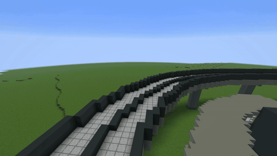
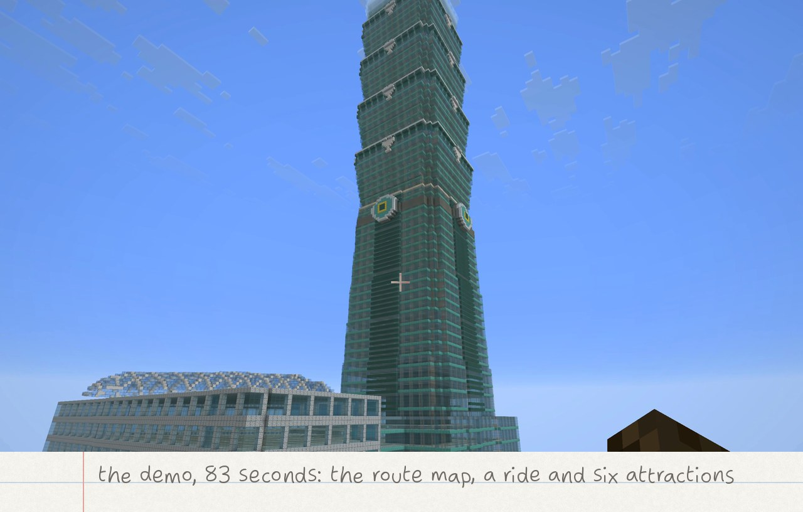

# Taipei Metro, rebuilt 1:1 in Minecraft

Every line, station and exit of the Taipei Metro at one block to the metre, generated from OpenStreetMap and a terrain model.

## Download

[The finished world](https://drive.google.com/file/d/19EMGXq1fSBxTu75KZ2nqXuztkm0jARfG/view?usp=sharing) is a 198 MB zip on Google Drive, 1.27 GB unzipped, for Minecraft Java Edition 26.2. It was last updated on 27 September 2026, with the ride system, the 14 attractions and the world raised to y639. Unzip it and put the `Taipei MRT` folder in `saves/`:

```bash
mv "Taipei MRT" ~/Library/Application\ Support/minecraft/saves/     # macOS
# Windows: %APPDATA%\.minecraft\saves\    Linux: ~/.minecraft/saves/
```



## Demo

[](https://github.com/rareone0602/taipei-mrt-minecraft/blob/main/demo/tour.mp4)

The route map lands you on the Tamsui-Xinyi Line platform at Taipei Main Station, and five clicks on the ride sign carry you five stations down the line. Then the video rises above Taipei Main Station and its exits, climbs Taipei 101 to the spire and visits five more attractions, walks out of Longshan Temple station to the temple, and follows the Circular Line's viaduct from Zhonghe (`demo/tour.mp4`, 83 seconds, 1280×816, 30 fps, silent). Click the picture to play it on GitHub.

## Once inside

You start on the Tamsui-Xinyi Line platform at Taipei Main Station, facing a ride sign. Right-click it and you ride to the next station, landing in front of the sign for the one after, so clicking again carries on down the line. The ticket-machine sign in every concourse, or the Quick Actions key (G by default), opens the route map: pick a line, then a station. Its last button, ★ 觀光景點 Attractions, takes you to a viewpoint in front of any of the 14 attractions. The long version is in [docs/gallery.md](docs/gallery.md#getting-about).

## What is in it

All ten operating lines and their branches, plus the Sanying Line, run over real terrain in tunnel, on viaduct and at grade. There are 193 stations, 472 exits at their real positions and with their real numbers, 16 interchange passages and 8.9 km of underground mall around Taipei Main Station; from the door of any exit you can walk to any platform without stepping on a block of soil. Fourteen attractions stand 1:1 where they do in the city. Taipei 101's spire is 508 m above the ground, so the world's ceiling was raised to y639 to fit it. The whole thing covers 482 km², which is why a program built it and not a person.

## Build it yourself

The OpenStreetMap data is already in `data/`. The terrain is not: fetch the two elevation models into `data/dem/` first ([sources](docs/building.md#data-sources)). Then:

```bash
python3 -m venv .venv && ./.venv/bin/pip install -r requirements.txt
./.venv/bin/python -m mrt.adapters.dem.make_heightmap   # DEM -> elevation grid
./.venv/bin/python -m cli.build_world                   # generate the world (--rails lays track)
cp -R "out/Taipei MRT" ~/Library/Application\ Support/minecraft/saves/
```

Refreshing the OSM data, and every other stage of the pipeline, is in [docs/building.md](docs/building.md#running-the-pipeline).

## Further reading

- [docs/building.md](docs/building.md): the pipeline, code layout, core decisions, tunnel layering, rails, data sources and licences.
- [docs/stations.md](docs/stations.md): stations, stacked stations, pocket tracks, signs, exits, interchange passages, Taipei Main Station and the ride system.
- [docs/attractions.md](docs/attractions.md): the 14 attractions, how they are built, and why the world is 704 blocks tall.
- [docs/verification.md](docs/verification.md): the tools that read the save back from disk, and what they have caught.
- [docs/limitations.md](docs/limitations.md): what is missing or approximate.
- [docs/gallery.md](docs/gallery.md): pictures from inside the world, and the long version of getting about in it.

## Credit and licence

Map data © OpenStreetMap contributors, under the ODbL. Terrain comes from the National Land Surveying and Mapping Center's 20 m DTM, with Copernicus DEM GLO-30 filling in Taoyuan (© DLR e.V. 2010-2014, © Airbus Defence and Space GmbH 2014-2018, under COPERNICUS by the European Union and ESA); neither is included here. The code is © 2026 rareone0602 under GPL-3.0 (`LICENSE`). The data in `data/` is under ODbL 1.0, and the screenshots, videos and generated world are Produced Works under it (`LICENSE-DATA`). [The details](docs/building.md#licence) include the attribution you must carry.
