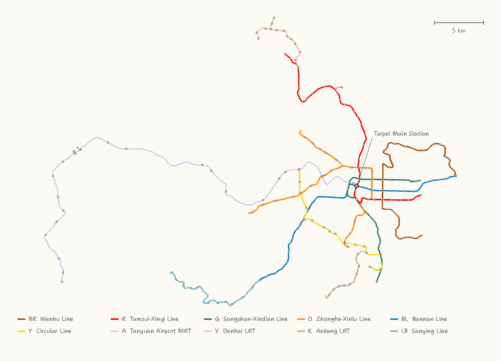

# How it is built

From OpenStreetMap and a terrain model to Anvil region files: the pipeline, the code, the decisions behind it, and the data it rests on.

## The network



Every alignment and every station on this map is the data the world is generated from (`data/mc_lines.json`, `data/mc_stations.csv`), plotted directly; it is not a schematic drawn separately. The 5 km scale bar is 5,000 blocks in the world.

## Running the pipeline

The full pipeline fetches OSM and DEM data and then spends twenty-odd minutes generating; most people would rather [download the finished world](../README.md#download). The OSM stages are only needed to refresh `data/`, which is already in the repository. The DEM stage needs the elevation models in `data/dem/`, which are not (see [data sources](#data-sources)).

```bash
python3 -m venv .venv && ./.venv/bin/pip install -r requirements.txt

./.venv/bin/python -m mrt.adapters.osm.fetch_network    # OSM line geometry
./.venv/bin/python -m mrt.adapters.osm.fetch_stations   # OSM station nodes
./.venv/bin/python -m mrt.adapters.osm.fetch_way_tags   # way tags (tunnel or bridge)
./.venv/bin/python -m mrt.adapters.osm.fetch_branch     # branches whose ref is non-standard
./.venv/bin/python -m mrt.adapters.osm.fetch_details    # exits, station buildings, platform levels
./.venv/bin/python -m mrt.adapters.osm.fetch_indoor     # underground walkways (malls, concourses)
./.venv/bin/python -m mrt.adapters.osm.fetch_sidings    # pocket tracks, crossovers, depot leads
./.venv/bin/python -m mrt.adapters.osm.fetch_attractions # building outlines for the attractions
./.venv/bin/python -m mrt.adapters.projection           # project to Minecraft coordinates
./.venv/bin/python -m mrt.adapters.dem.make_heightmap   # DEM -> elevation grid
./.venv/bin/python -m cli.build_world                   # generate the world (--rails to lay track)

cp -R "out/Taipei MRT" ~/Library/Application\ Support/minecraft/saves/
```

The dependencies, with pinned versions, are in `requirements.txt`, which notes the stage each one serves. The venv is Python 3.9, and the code uses no 3.10+ syntax. `rasterio` is needed only to rerun the DEM stage and `pillow` only for the plan views drawn by `tools/verify_render.py`; leave both out and every other step still runs. Once they are installed, run everything with `./.venv/bin/python`.

The generator also writes the ride system's datapack into the save. A save without a `datapacks/taipei_mrt/` folder was generated before the ride system existed, and has no ride signs, route map or attractions menu; generating it again adds them.

## Code layout

Dependencies point inwards only; an inner layer may never import an outer one.

```
mrt/
  config.py         Paths and the world's vertical range. Every layer may import it
  domain/           Pure rules, no I/O
    alignment.py      Sampling, vertical profiles, track offsets, route variant selection
    geometry.py       Polygon fill, outer-wall outlines, hip roofs
    rails.py          Centerline -> rail blocks and shapes
    terrain.py        Elevation grid sampling
    tunnel_layers.py  Depth-band assignment for underground lines
    concourse.py      Underground malls: level tag parsing, node merging and
                      connectivity, links to exits
    exits.py          Real exits and transfer passages: placing shafts and passages,
                      keeping clear of every structure
    walk.py           Walkability: flood fill from a "can you stand here" predicate
    network.py        Ride system: next station, termini, every ride sign and berth
                      on the platforms
  ports/            Interfaces the inner layers open to the outer ones
    block_sink.py     BlockSink (per block), ChunkSink (batched), SignSink (signs: text
                      components, glow, click commands, dialogs), DictSink (for tests)
  application/      Use cases: write what the domain computes into a BlockSink
    build_line.py     Underground, elevated and at-grade cross-sections, and stations
    build_world.py    Terrain chunk assembly, corridor blending
    landmarks.py      Taipei Main Station (built from the real drawings, not the template)
    build_concourse.py Underground malls: floors, shopfronts, exit stairs, stair shafts
                      between levels
    build_exits.py    Real exits and transfer passages: turns the plan from exits.py into
                      stair shafts, link passages and footbridges
    signage.py        Station signs: ride signs, line-color bands, concourse wayfinding,
                      exit sign style
    build_br.py       Wenhu Line only (a vertical slice of the first line, kept for comparison)
    ride_plan.py      Datapack spec for the ride system: teleport functions, route map
                      dialogs, first join, station arrival notices
    spawn.py          Spawn point: outside the exit kiosk at Taipei Main Station
                      (computed from the plan, not read from the save)
    attractions/      Attractions: kit.py (frames, roofs, site grading, keep-out guard) plus
                      one module per attraction or group
                      -- taipei101, shin_kong, cks_memorial, sun_yat_sen, presidential_office,
                      national_taiwan_museum, red_house, city_gates, longshan_temple,
                      grand_hotel, miramar_wheel
  adapters/         Outside data coming in
    osm/              Overpass queries and parsing
    dem/              DEM resampling
    projection.py     WGS84 -> TWD97/TM2 -> Minecraft block coordinates
  infrastructure/   External technical details
    mcworld.py        Anvil region file writer (implements BlockSink / ChunkSink)
    savereader.py     Anvil reader: reads a volume into a queryable block array, reads signs
    overpass.py       Overpass HTTP: mirror rotation, retries, cache
    datapack.py       Writes the datapack spec as a 26.2 datapack (pack.mcmeta, functions,
                      dialogs, tags, and the dimension type that raises the overworld
                      to 704 blocks)
    heightmap.py      A chunk's four heightmaps: which blocks count and how they are packed
                      (bit-identical to the game)

cli/                Composition root. The only place that sees every implementation
tools/              Verification and inspection: read the save back independently
                    instead of trusting the generator's own account
tests/              Tests that run without generating a world
```

The generators always took the world as a parameter (`def build_station(w, ...)`) and only ever called `w.set()`. The interface existed already; `ports/block_sink.py` merely names it. So a test can pass in a dict instead of generating a 1 GB save first.

`tests/test_architecture.py` holds the layers in place. It parses every module's imports and fails when an inner layer imports an outer one. The directory names on their own would stop nobody.

## Core decisions

| Item | Choice | Reason |
|---|---|---|
| Scale | 1 block = 1 m | A six-car train is about 138 m; only at this scale do platforms, fare gates and stairs come out the right size |
| Projection | TWD97 / TM2 (EPSG:3826) | The coordinate system of the National Land Surveying and Mapping Center's open DTM, so the terrain drops straight in |
| Origin | Taipei Main Station = MC (0, 0) | TWD97 E=302214.8 N=2770999.4 (the OSM node `ref=R10`) |
| Axes | MC X = east, Z = south | North is −Z |
| Sea level | y = 62 | The floor of the Taipei Basin is at about y=67–92; the deepest station at about y=42 |

World coordinates are therefore metres from Taipei Main Station. As a check, Taipei 101 (25.0330, 121.5654) projects to TWD97 E=307,056.8 N=2,769,551.8, which matches the published value.

## Pipeline stages

**1. OSM line geometry.** The Overpass API, with three mirrors in rotation and nine retries. A relation's members come in no guaranteed order and may point either way, so chaining them naively draws phantom straight lines across the map: before stitching, the network "measured" 401 km, and after it, 210 km. `stitch()` joins pieces at matching endpoints and starts a new piece when nothing matches, preferring a gap to a straight line.

Check the date of a mirror's data. The Sanying Line kept failing to appear, and not because it was still under construction. Its relation has carried `ref=LB` since 2015, but the tag `route=subway` was added only on 30 June 2026, and until then a query filtering on the route type returned nothing. The empty file came from a mirror whose data was frozen on 31 May 2026, and `fetch_network` skipped any file that already existed, so an empty file was never fetched again. (It is now: an empty `elements` counts as not fetched.) The list of lines in `fetch_way_tags` needs LB too, or the whole line is treated as at grade; in fact it is 100% elevated.

Each line's length can be checked against the official figures: Wenhu Line 25.7 km (official 25.7), Tamsui-Xinyi Line 29.6 (29.5), Circular Line 15.3 (15.4), Taoyuan Airport MRT 51.9 (51.0).

**2. Tunnel or viaduct.** A relation's `out geom` does not include its member ways' tags, but it does give their ids, so the tags are fetched in a second query and joined. The result matches reality: the Bannan, Songshan-Xindian and Zhonghe-Xinlu lines are 100% underground, the Circular Line is 97% elevated, and the Tamsui-Xinyi Line has all three.

**3. Branches.** One line often has several relations in OSM: one per direction, branches, and express and stopping services. Build them all and the two directions become two structures side by side; build only the longest and the branches go missing. `select_variants()` works in two steps. First it merges the two directions by pairing endpoints (the same endpoints, or swapped, with lengths within 20%); then it ranks the survivors by the absolute length they add that nothing else covers. That brings 32 variants down to 13.

Of the 185 stations in `mc_stations.csv` at the time, 172 lay within 150 m of a chosen variant. The 13 that did not fell into two groups. Eleven were on the Sanying Line, whose route relation had not yet been fetched (see [limitations](limitations.md)); the other two were Airport Terminals 1 and 2, whose station nodes sit on the terminal buildings rather than the platforms, 176 m and 311 m from the line.

**4. Vertical profile.** The target height is the ground plus an offset (elevated +13 m, at grade +1 m, tunnel −20 m), smoothed by taking the lower envelope under a maximum gradient of 4%. Ramps appear in front of tunnel portals by themselves. **The type of structure follows the actual elevation, not the OSM tag**: approaches still tagged `bridge` have already dropped below ground, and building by the tag would bury the deck in soil.

**5. Terrain.** The DEM is resampled onto a 20 m grid with Taipei Main Station at the origin. The main source is the National Land Surveying and Mapping Center's 20 m **DTM**, which is natively in TWD97 / TM2, the project's own coordinate system, so sampling it is a translation with no reprojection at all. Terrain is generated only along the line corridors (by default ±96 m in full, then a 64 m blend back to flat sea level); paving the whole 43 × 30 km would take millions of chunks.

**6. Writing the world.** `mcworld.py` writes Anvil region files directly, without any Minecraft library. In 26.2 the save layout is `dimensions/minecraft/overworld/region/`, and the world-generation settings have moved to `data/minecraft/world_gen_settings.dat`. Writing streams region by region: the terrain for the whole area does not fit in memory, so each region is built, written and freed in turn.

## Two traps

**A chunk you write must carry its own background strata.** Chunks are marked `Status: minecraft:full`, so the game will not generate terrain in them. Leave them empty and the tunnels hang in the void like pipes.

**From 1.21.5, sign text is native NBT, not a JSON string.** `messages` is a List of four plain strings, and an NBT list must be homogeneous: slip a compound in and it breaks. Because the world is written at DataVersion 4903 directly, there is no DataFixerUpper to convert the old format.

## Rails

**Not laid by default.** The track bed (`smooth_stone`) stays; whether to lay track, and what kind, is left to the player and their mods. `cli.build_world --rails` lays a set of vanilla rails.

If you do lay them, `mrt/domain/rails.py` turns the floating-point centre line into rails that a minecart can run the length of. The world is written straight to NBT with no block updates, so each rail's `shape` has to be worked out correctly in advance: rails do not join themselves up. The rules are that a diagonal step splits into two orthogonal steps; a sloped rail cannot also be a curve, so the rise moves to the nearest straight section; two adjacent edges may not both rise; and powered rails have no curved shape. Every 12 blocks there is a powered rail, fed by a block of redstone beneath it.

`tools/verify_rails.py` reads the save back independently to check the connections. A run with `--rails` laid 584,639 rails and found 27 places where the other side did not connect back, all of them where a branch leaves its own line (the Xiaobitan branch of the Songshan-Xindian Line, the split between express and stopping services on the Taoyuan Airport MRT, and the fork on the Zhonghe-Xinlu Line). There are no real turnouts; see [limitations](limitations.md#track).

## Tunnel layering

Where two lines meet underground they must be kept apart, or the one built later overwrites the one built first.

**The old approach gave each line one fixed depth, and got the question of which lines to separate wrong.** It judged by the lines' current vertical separation, which is exactly what layering produces: a circular argument. `BL–O` and `A–G` slipped through this way and were in fact in the same blocks. Even judged by horizontal distance alone, the BL, G, O and R lines all cross one another in the city centre (a complete graph, K4), so one fixed depth per line would need four layers and digging down to 60 m. The real system is about 30 m deep at its deepest.

`mrt/domain/tunnel_layers.py` now **assigns a band at every sample point**. A line takes the shallowest band and changes only when another line occupies it, and when it changes it looks 1.5 km ahead and picks the band that stays free longest. The 4% limit on the vertical profile stretches each change into a 375 m descent automatically, with no special handling.

**A change of band needs a ramp's head start.** The band is only a target depth; the real elevation comes from the gradient envelope. Change band only at the block where the current band is taken, and the ramp starts its descent at the conflict, which is then still halfway down. That is how the Songshan-Xindian Line came to stop 27 m down at Songjiang Nanjing, 3 m above the Zhonghe-Xinlu Line's station box at 30 m, and the two boxes overlapped; the band check looks at band numbers, and the band numbers did not conflict. Now the assignment looks 375 m ahead and changes early if the current band will be taken there, and the old band stays occupied until the ramp is finished, so that no other line slips in underneath it. The radius of a station pin must likewise cover half a station box plus a ramp (410 m): at 120 m the ramp reached into the station box and dragged the Tamsui-Xinyi Line at Zhongshan, pinned at B2, down to 21 m.

| Depth band | Length | Share |
|---|---:|---:|
| 15 m down | 88.1 km | 74.2% |
| 30 m down | 24.9 km | 21.0% |
| 45 m down | 5.7 km | 4.8% |

Conflicts between lines: **0**. The script checks itself: where the underground blocks of two different lines are adjacent, their bands must differ.

**Pins.** The greedy algorithm knows only that lines must not collide, not which of them is on top in reality. `station_pins()` recovers the real order from the `level` tags on OSM platforms. OSM's `station_ref` gives only the station code, not the line a platform belongs to, so that is settled geometrically, by the line nearest the platform's centre line. Doubtful cases (the nearest line more than 15 m away, or the second-nearest less than twice as far) are skipped rather than guessed. There are six pins at three stations:

| Station | Upper | Lower |
|---|---|---|
| Taipei Main Station | Bannan Line, B3 | Tamsui-Xinyi Line, B4 |
| Zhongshan | Tamsui-Xinyi Line, B2 | Songshan-Xindian Line, B3 |
| Zhongxiao Xinsheng | Bannan Line, B2 | Zhonghe-Xinlu Line, B3 |

## Data sources

- **Network and stations**: OpenStreetMap (ODbL).
- **Attractions**: position, orientation, outline and `height` / `building:part` from OpenStreetMap (ODbL). Their appearance follows published architectural facts (Wikipedia, the websites of the Presidential Office and the National Taiwan Museum, the Bureau of Cultural Heritage, the National Cultural Memory Bank and others; each module's comments list its sources). Only facts were taken; no text, photographs or 3D models were copied.
- **Taipei Main Station drawings**: Taiwan Railway's leased-area diagram (出借範圍示意圖, approved edition in force from 1 January 2025, 1140101 in the Minguo calendar). Its 8.75 m column grid independently confirms the 149 × 110 m footprint and the eight hall columns.
- **Terrain (main)**: the National Land Surveying and Mapping Center's 20 m **DTM** (Ministry of the Interior), 2025 sheets, 403 of them for Taipei City and New Taipei City.
  - They live in `data/dem/nlsc20/*.zip` and **need no unzipping**: `make_heightmap.py` reads the zips directly.
  - Each sheet is an ASCII file of `E N Z` rows, natively in TWD97 / TM2 + TWVD2001, on a regular 20 m grid.
  - `tgos.tw` blocks curl, so the two archives were downloaded in a browser by someone else and handed over.
- **Terrain (filling gaps)**: Copernicus DEM GLO-30 (© DLR e.V. 2010-2014, © Airbus Defence and Space GmbH 2014-2018, under COPERNICUS by the European Union and ESA), in `data/dem/copernicus/`.
  - The DTM covers only Taipei and New Taipei. Where the western end of the Airport MRT enters Taoyuan there is no DTM, so that area falls back to GLO-30.
  - GLO-30 is a **DSM**, with buildings and tree canopy baked into the elevation, so it reads systematically high (a median of +4.8 m along the network). The bias is subtracted before filling, and the seam is feathered over 400 m so that no cliff appears.

## Licence

Code and data are licensed separately, because the data's licence is inherited from OpenStreetMap rather than chosen.

| Scope | Licence | File |
|---|---|---|
| Code (`mrt/`, `cli/`, `tools/`, `tests/`, `demo/make_demo.py`) | GPL-3.0 | `LICENSE` |
| Data (`data/`) | ODbL 1.0 | `LICENSE-DATA` |
| Screenshots and videos (`demo/`) | Produced Work under ODbL 1.0 | `LICENSE-DATA` |
| The generated world, including the station names and route map in `datapacks/taipei_mrt/` | Produced Work under ODbL 1.0 | `LICENSE-DATA` |

```
Copyright (C) 2026 rareone0602

This program is free software: you can redistribute it and/or modify
it under the terms of the GNU General Public License as published by
the Free Software Foundation, either version 3 of the License, or
(at your option) any later version.

This program is distributed in the hope that it will be useful,
but WITHOUT ANY WARRANTY; without even the implied warranty of
MERCHANTABILITY or FITNESS FOR A PARTICULAR PURPOSE.  See the
GNU General Public License for more details.

You should have received a copy of the GNU General Public License
along with this program.  If not, see <https://www.gnu.org/licenses/>.
```

Both licences are copyleft: distribute a modified version and the code must be released under GPL-3.0 and the data offered under the ODbL.

Every file under `data/` derives from OpenStreetMap, and **any use must carry the attribution**:

    © OpenStreetMap contributors — https://www.openstreetmap.org/copyright

The raw terrain data (the NLSC DTM and Copernicus GLO-30) is **not included in this repository**; each comes under its own terms, listed in [data sources](#data-sources). `data/heightmap.json` holds only the grid's metadata (origin, spacing, extent) and no elevation values.
