# Inside the world

Screenshots from the world, and the long version of getting about in it.

## Pictures

| | |
|:--:|:--:|
| 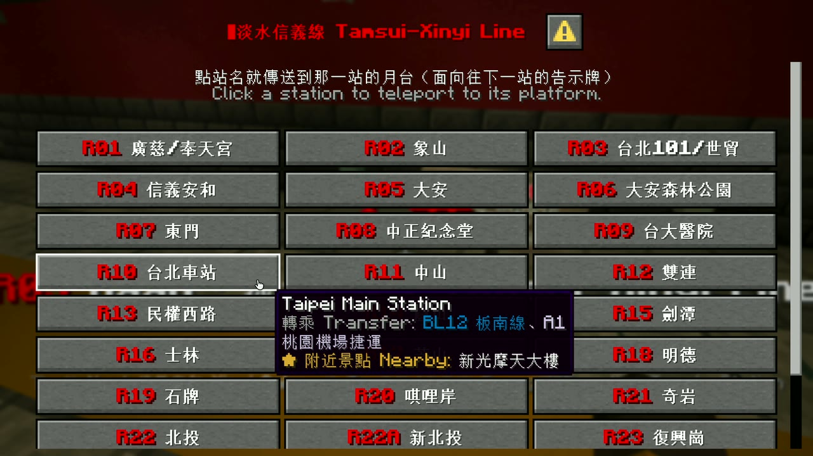 | 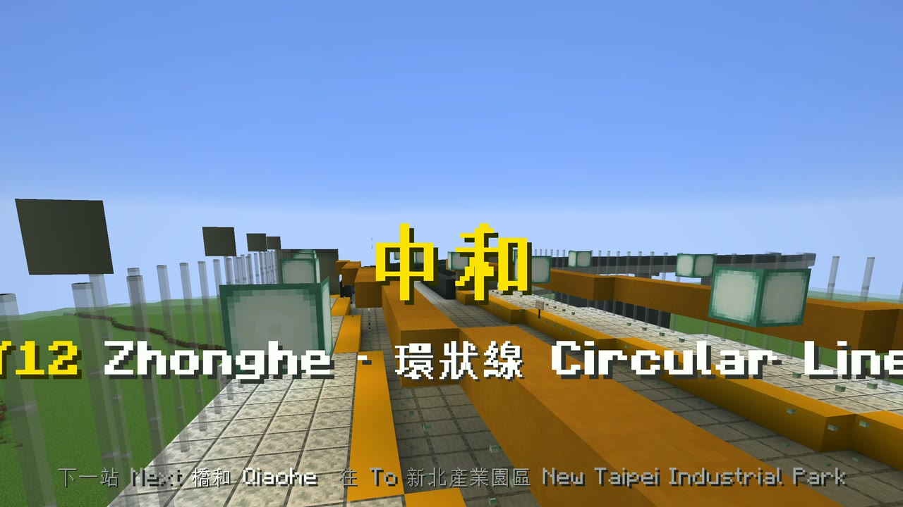 |
| **Route map.** Click a line, then a station, and you are teleported there. The tooltip on Taipei Main Station lists its interchanges and the attraction nearby. | **Arrival.** The station name as a title in the line's colour, the station code and line as a subtitle, and the next station in the action bar: Zhonghe, on the Circular Line. |
| 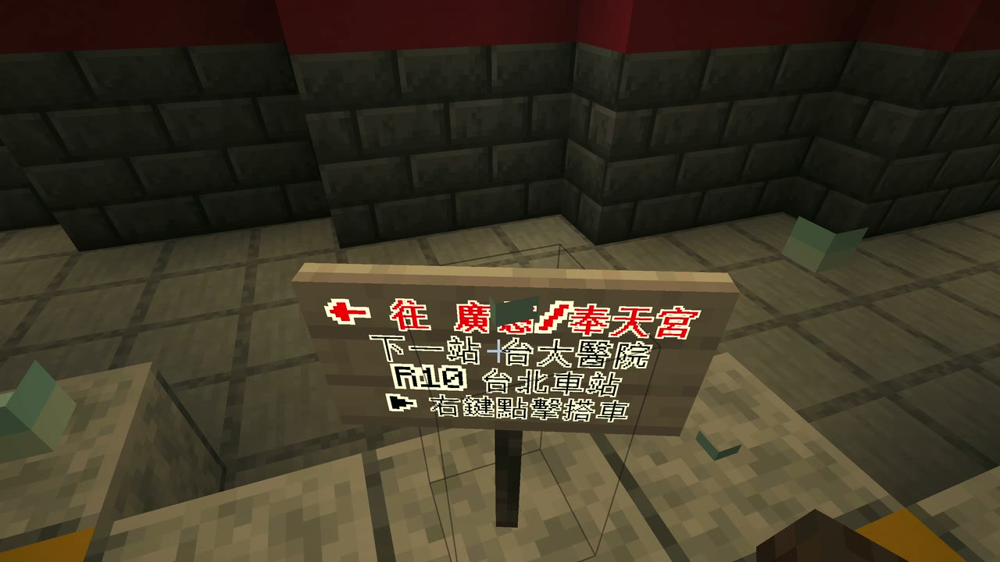 | 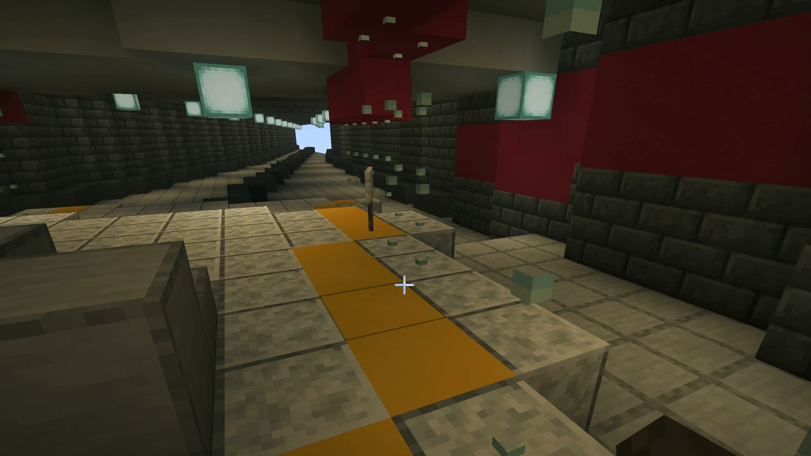 |
| **Ride sign.** Right-click it and you ride to the next station: this one runs towards Guangci/Fengtian Temple, next stop NTU Hospital. | **Island platform.** The Tamsui-Xinyi Line at Taipei Main Station, with a yellow warning strip along each edge and the line's red above the platform screen doors. |
| 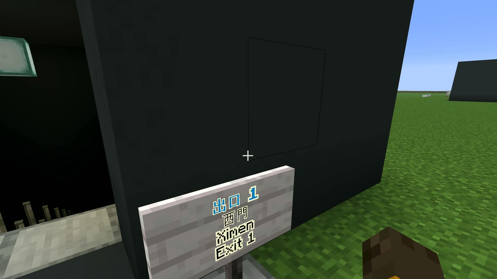 | 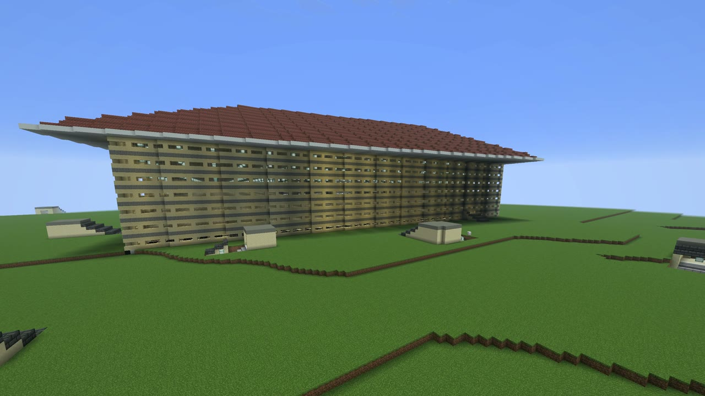 |
| **Exit.** Ximen exit 1. The sign carries the real number, the station's name in Chinese and English, and "Exit 1". | **Taipei Main Station from above.** The station building and, dotted around it, the kiosks of its exits, each where OSM puts it. |
| 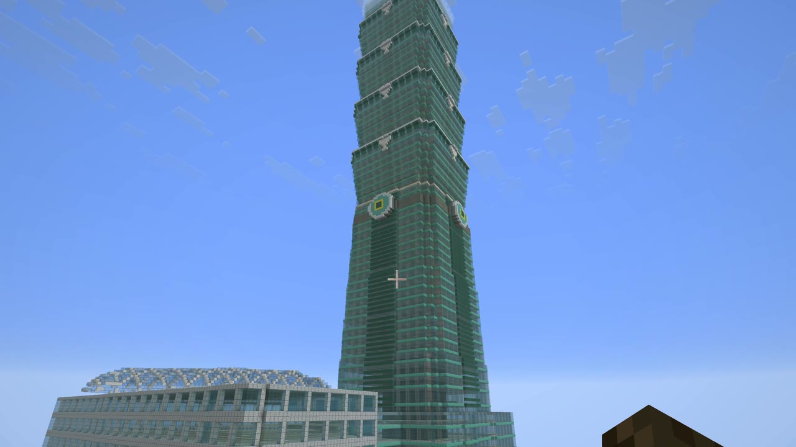 | 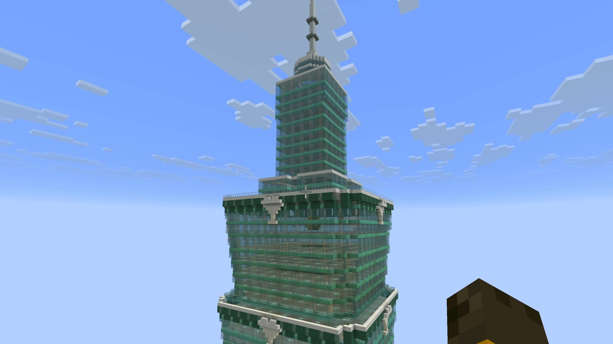 |
| **Taipei 101.** The viewpoint you teleport to. OSM's `building:part` entries stack up the tapered base, the eight flared segments and the spire. | **The top.** The last sections and the spire, 508 m up, which is why the world was raised to y639. |
| 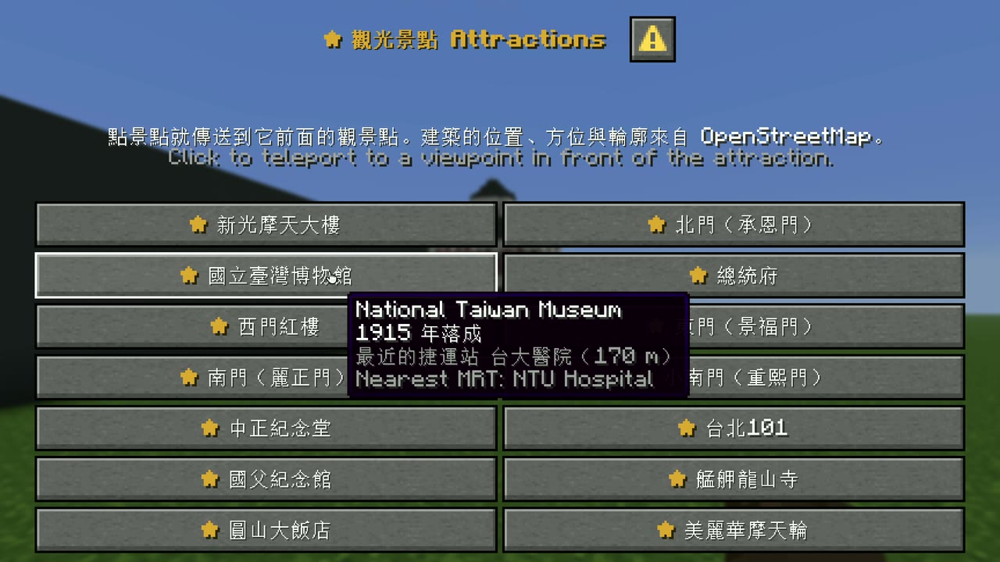 | 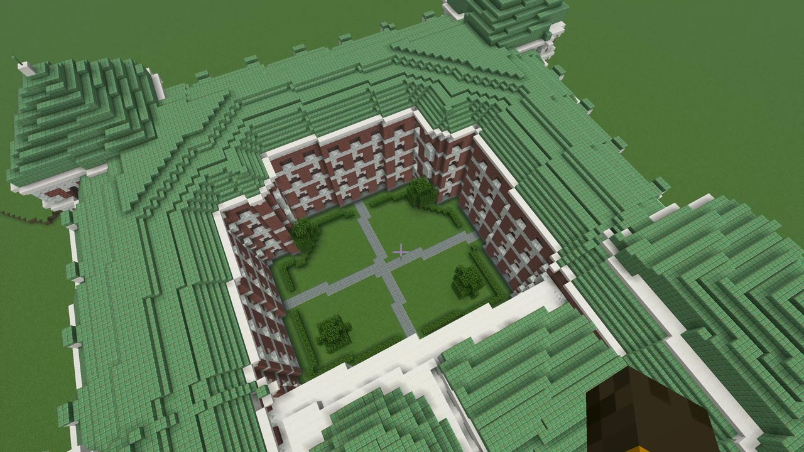 |
| **★ Attractions.** The last button on the route map: 14 attractions, with tooltips giving the year each was completed and the nearest station. | **Presidential Office Building.** Completed in 1919. One of its two courtyards, from above. |
| 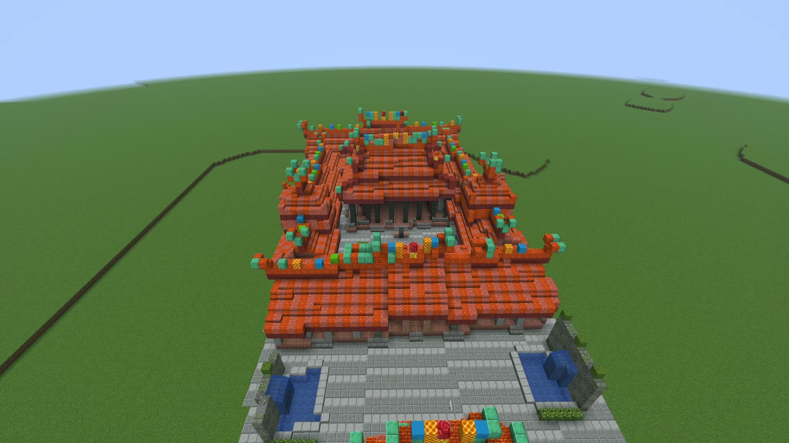 | 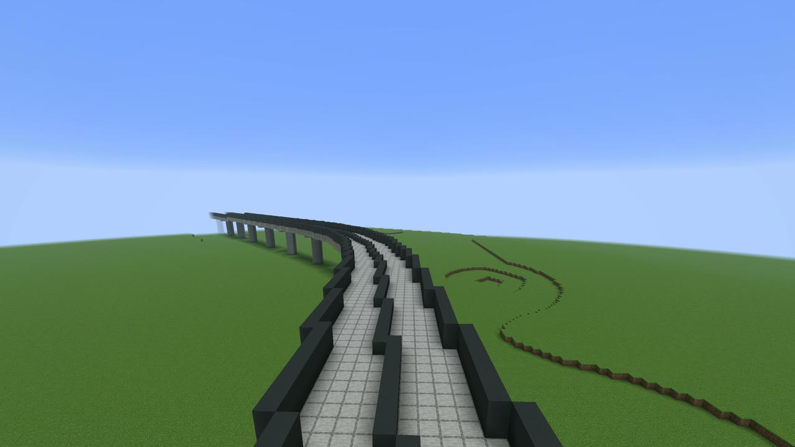 |
| **Longshan Temple.** Founded in 1738, and 223 m from Longshan Temple station, as in the city. | **Circular Line.** The viaduct near Zhonghe, on its alignment from OSM. |

All twelve come from one recording, made on 28 September 2026. The views from above were taken in spectator mode.

## Getting about

**The first time you enter**, you are put on the Tamsui-Xinyi Line platform at Taipei Main Station (R10), facing a ride sign, with a note in Chinese and English in the chat. After that you respawn at the door of the kiosk at Taipei Main Station's exit M4.

**To ride**, right-click the sign on the platform screen doors, such as "← 往 淡水／下一站 中山" or its English twin, "← To Tamsui / Next: Zhongshan". You arrive at the next station facing the sign that carries on in the same direction, so clicking again rides on, one station per click. At a terminus, the sign on the arrival side sends you across to the opposite platform.

**The route map** opens from the Quick Actions key (G by default), the 台北捷運路線圖 Route Map button in the pause menu, the ticket-machine sign in every concourse, or `/trigger mrt.menu`. Click a line, then a station, and you are teleported there.

**On foot**, every exit leads to the platforms, with signs either side of the fare gates and at the head of each stair. The station's name lights up in the action bar as you walk in.

**The attractions** are listed under ★ 觀光景點 Attractions, the last button on the route map; each of the 14 teleports you to a viewpoint in front of the building. Stations within 900 m of one have a ★ sign by the ticket machine in the concourse that takes you straight there. In Taipei 101's ground-floor lobby, a sign marked 89 樓觀景台 ▲ (89F Observatory) takes you up to the observatory at 382 m.

**On its first load** the world turns off hostile mobs, stops the clock at noon, clears the weather and lets you keep your inventory when you die. 253 km of tunnel would otherwise fill with monsters the moment the lights went out. The chat lists each change and how to undo it; click a line and the command fills itself in.

A save without a `datapacks/taipei_mrt/` folder was generated before the ride system existed and has none of the above; generating it again adds them. World coordinates are metres, and the origin, (0, 0), is Taipei Main Station (OSM `ref=R10`).
