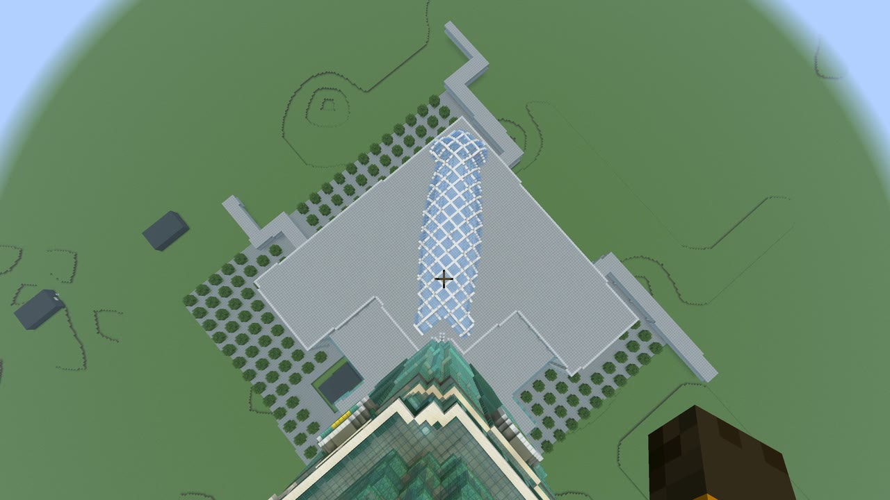
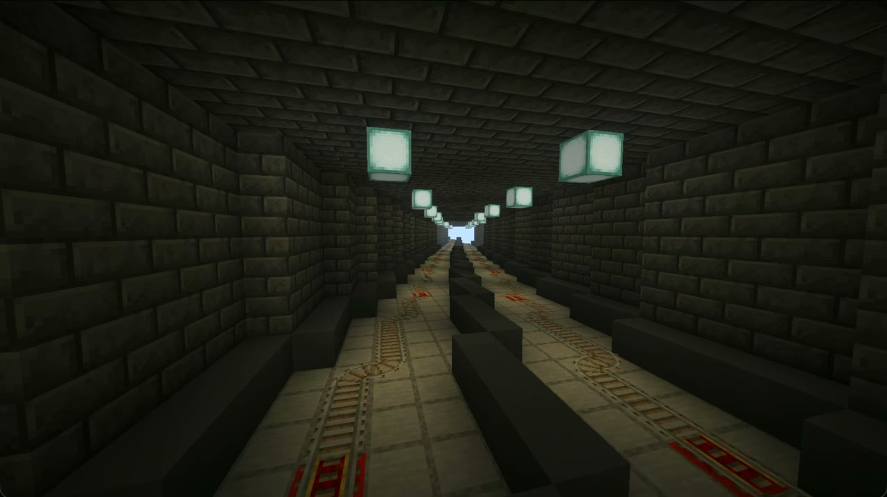
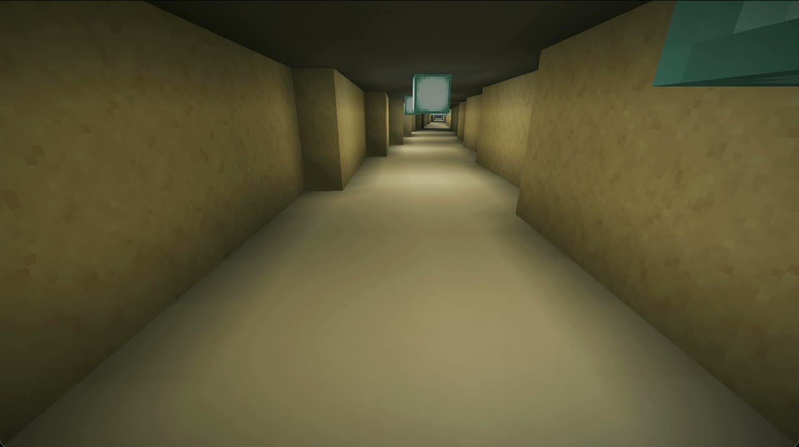
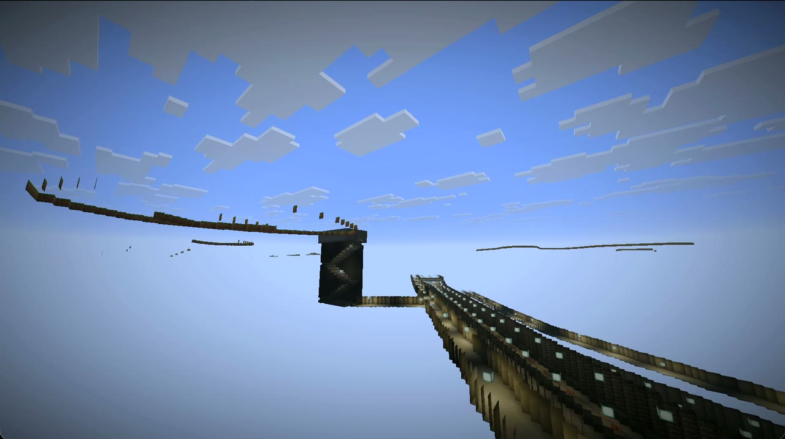
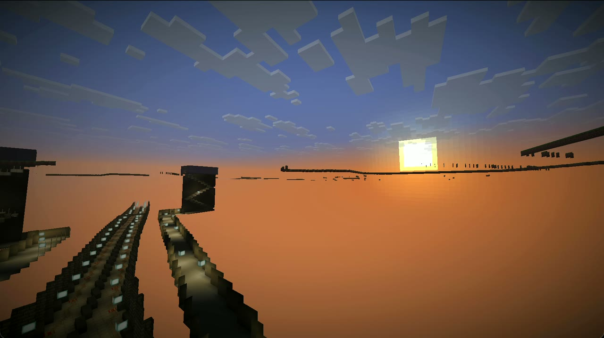

# Inside the world

Screenshots from the world, and the long version of getting about in it.

## Pictures

| | |
|:--:|:--:|
|  |  |
| **Taipei 101.** The viewpoint you teleport to. OSM's `building:part` entries stack up the tapered base, the eight flared segments and the spire. | **Looking down from the spire.** 508 m up, which is why the world was raised to y639. Below is the roof of the shopping centre. |
|  |  |
| **★ Attractions.** The last button on the route map: 14 attractions, with tooltips giving the year each was completed and the nearest station. | **Route map.** Click a line, then a station, and you are teleported there. Tooltips list interchanges and nearby attractions. |
|  |  |
| **Arrival.** The station name as a title in the line's colour, the station code and line as a subtitle, and the next station in the action bar. | **Exit.** Up the stairs from the platform, and the sign carries the real number: Gongguan exit 2. |
|  |  |
| **Island platform.** An underground station's island platform, with a yellow warning strip along each edge. | **Station-name sign.** With the real codes: `R10;BL12 台北車站`. Taken before the ride system; a ride sign now stands here (see [signs](stations.md#signs)). |
|  |  |
| **Twin-track tunnel.** A track on each side, and rails that connect across the whole network. | **Walkways.** The concourse and an interchange passage. From exit to platform you never step on soil. |
|  |  |
| **Station cutaway.** The stairs in an underground station box, from concourse to platform. | **Alignment.** One block to the metre, all the way to the skyline. |

The last two were taken in spectator mode from inside the ground. When the camera is inside a solid block Minecraft does not draw the surface, which is how the tunnels and station boxes show through. The world has no holes in it.

## Getting about

**The first time you enter**, you are put on the Tamsui-Xinyi Line platform at Taipei Main Station (R10), facing a ride sign, with a note in Chinese and English in the chat. After that you respawn at the door of the kiosk at Taipei Main Station's exit M4.

**To ride**, right-click the sign on the platform screen doors, such as "← 往 淡水／下一站 中山" or its English twin, "← To Tamsui / Next: Zhongshan". You arrive at the next station facing the sign that carries on in the same direction, so clicking again rides on, one station per click. At a terminus, the sign on the arrival side sends you across to the opposite platform.

**The route map** opens from the Quick Actions key (G by default), the 台北捷運路線圖 Route Map button in the pause menu, the ticket-machine sign in every concourse, or `/trigger mrt.menu`. Click a line, then a station, and you are teleported there.

**On foot**, every exit leads to the platforms, with signs either side of the fare gates and at the head of each stair. The station's name lights up in the action bar as you walk in.

**The attractions** are listed under ★ 觀光景點 Attractions, the last button on the route map; each of the 14 teleports you to a viewpoint in front of the building. Stations within 900 m of one have a ★ sign by the ticket machine in the concourse that takes you straight there. In Taipei 101's ground-floor lobby, a sign marked 89 樓觀景台 ▲ (89F Observatory) takes you up to the observatory at 382 m.

**On its first load** the world turns off hostile mobs, stops the clock at noon, clears the weather and lets you keep your inventory when you die. 253 km of tunnel would otherwise fill with monsters the moment the lights went out. The chat lists each change and how to undo it; click a line and the command fills itself in.

A save without a `datapacks/taipei_mrt/` folder was generated before the ride system existed and has none of the above; generating it again adds them. World coordinates are metres, and the origin, (0, 0), is Taipei Main Station (OSM `ref=R10`).
